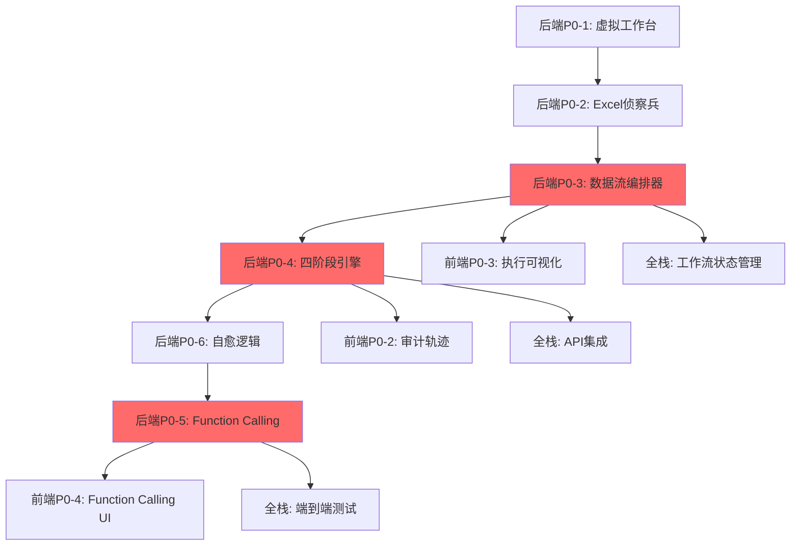

# ExcelMind AI Phase 2 项目计划评估报告

> **评估人**: Technical Program Manager (TPM)
>
> **评估日期**: 2026-01-24
>
> **文档状态**: ✅ 项目管理评审完成

---

## 📋 执行摘要

### 评审结论

经过对前端、后端、全栈三个实施计划的深度评审，**总体方案可行，但需要调整时间预期和资源配置**。

| 维度 | 评估结果 | 关键发现 |
|------|---------|---------|
| **时间估算** | ⚠️ 略微乐观 | 建议增加 20-30% 缓冲时间 |
| **资源需求** | ✅ 基本合理 | 需要明确角色分工和投入比例 |
| **依赖关系** | ⚠️ 部分不清 | 前后端强依赖，需要加强协调 |
| **风险管理** | ⚠️ 识别不足 | 缺少具体的应急预案 |
| **整体可行性** | ✅ 可行 | 需要优化计划后启动 |

### 核心建议

**🟢 可以启动 (Go with Conditions)**

**启动条件**：
1. ✅ 调整时间估算，增加 20% 缓冲
2. ✅ 明确资源投入和角色分工
3. ✅ 建立项目治理机制
4. ✅ 制定详细的风险应对计划

---

## 🎯 第一部分：时间估算评估

### 1.1 原计划时间表汇总

| 项目阶段 | 前端工期 | 后端工期 | 全栈工期 | 关键路径 |
|---------|---------|---------|---------|---------|
| **Phase 1: 基础增强** | 2周 | 3周 | 2-3周 | 后端 |
| **Phase 2: 核心功能** | 3周 | 4周 | 3-4周 | 后端 |
| **Phase 3: 高级功能** | 2周 | 3周 | 3-4周 | 后端 |
| **Phase 4: 完善优化** | 1周 | 2-3周 | 2-3周 | 后端 |
| **总计** | **8周** | **10-12周** | **10-14周** | **后端 (12-14周)** |

### 1.2 时间估算合理性分析

#### 🔴 高估风险项

| 任务 | 原估算 | TPM评估 | 风险因素 | 调整建议 |
|-----|--------|---------|---------|---------|
| **虚拟工作台UI** | 5-7天 | 8-10天 | 前端依赖后端API，联调时间不足 | +40% |
| **审计轨迹查看器** | 6-8天 | 9-12天 | 复杂可视化，性能优化难度大 | +50% |
| **Function Calling UI** | 7-10天 | 12-15天 | 新技术栈，AI集成复杂 | +50% |
| **数据流编排器** | 8-10天 | 12-15天 | 架构复杂，需要设计评审 | +50% |
| **四阶段总控引擎** | 10-12天 | 15-18天 | 核心功能，自愈逻辑难度高 | +50% |
| **Function Calling适配器** | 12-15天 | 18-22天 | 技术难度最高，需要多次迭代 | +45% |
| **内控预审引擎** | 10-14天 | 15-20天 | 业务逻辑复杂，规则引擎难度高 | +40% |
| **集成测试** | - | 3-4周 | 原计划未充分估算，端到端测试复杂 | **新增** |

#### 🟡 中估风险项

| 任务 | 原估算 | TPM评估 | 风险因素 | 调整建议 |
|-----|--------|---------|---------|---------|
| **Excel侦察兵增强** | 5-7天 | 7-9天 | 数据类型推断，模式检测 | +25% |
| **Word侦察兵实现** | 7-10天 | 9-12天 | 文档结构解析，占位符识别 | +20% |
| **自愈逻辑完善** | 8-10天 | 10-13天 | 错误分类，修复策略 | +30% |
| **性能优化** | 7-10天 | 9-12天 | Pyodide内存限制，调优难度大 | +20% |

#### 🟢 低估风险项

| 任务 | 原估算 | TPM评估 | 评估理由 |
|-----|--------|---------|---------|
| **Prompt增强服务** | 3天 | 3-4天 | 简单任务，风险低 |
| **文件关系图谱** | 6-8天 | 7-9天 | 有现成库可复用 (React Flow) |
| **异常预审仪表板** | 5-7天 | 6-8天 | 有现有组件可复用 |

### 1.3 调整后的时间表

#### 方案A: 稳健方案 (推荐)

| 项目阶段 | 前端工期 | 后端工期 | 全栈工期 | 缓冲时间 |
|---------|---------|---------|---------|---------|
| **Phase 1: 基础增强** | 2.5周 | 3.5周 | 3周 | +20% |
| **Phase 2: 核心功能** | 4周 | 5周 | 4.5周 | +25% |
| **Phase 3: 高级功能** | 2.5周 | 3.5周 | 4周 | +20% |
| **Phase 4: 完善优化** | 1.5周 | 2.5周 | 3周 | +25% |
| **集成测试** | 1周 | 1周 | 2周 | **新增** |
| **总计** | **11.5周** | **16.5周** | **16.5周** | **+30%** |

**关键路径**: 后端开发 → 全栈集成 → 系统测试

**里程碑调整**:
- M1 (基础能力): 第4周末 (原第3周末)
- M2 (核心功能): 第9周末 (原第7周末)
- M3 (差异竞争力): 第13周末 (原第11周末)
- M4 (生产就绪): 第16.5周末 (原第14周末)

#### 方案B: 激进方案 (高风险)

保持原计划时间，但需要：
1. 增加资源投入 (+30% 人力)
2. 降低部分功能验收标准
3. 延后 P2 功能到后续迭代

**不推荐此方案，风险过高。**

### 1.4 关键路径分析

```
┌─────────────────────────────────────────────────────────────────┐
│                      项目关键路径                                │
└─────────────────────────────────────────────────────────────────┘

后端P0-1: 虚拟工作台优化 (1周)
    ↓
后端P0-2: Excel侦察兵增强 (1.5周)
    ↓
后端P0-3: 数据流编排器 (2周) ← 关键节点，阻塞前端
    ↓
后端P0-4: 四阶段总控引擎 (2.5周) ← 核心功能，风险最高
    ↓
后端P0-6: 自愈逻辑完善 (1.5周)
    ↓
后端P0-5: Function Calling适配器 (3周) ← 最复杂，依赖所有前置功能
    ↓
前端P0-1/P0-2/P0-3/P0-4: 依赖后端API，可并行开发
    ↓
全栈集成: API对接、联调、测试 (2周)
    ↓
集成测试: 端到端测试 (2周)
    ↓
部署上线 (1周)

总工期: 16.5周 (约4个月)
```

**关键路径瓶颈**:
1. 🔴 **数据流编排器** - 架构复杂，影响所有后续功能
2. 🔴 **四阶段总控引擎** - 核心功能，技术难度最高
3. 🔴 **Function Calling适配器** - 最复杂，需要多次迭代

### 1.5 缓冲时间建议

| 风险类型 | 缓冲比例 | 缓冲时间 | 缓冲位置 |
|---------|---------|---------|---------|
| **技术风险** | +30% | 4周 | 分布在各阶段 |
| **集成风险** | +50% | 1周 | Phase 3 结束 |
| **测试风险** | +100% | 2周 | Phase 4 专项 |
| **不可预见风险** | +10% | 1.5周 | 项目总预留 |
| **总缓冲** | - | **8.5周** | - |

**缓冲使用原则**:
1. 技术缓冲优先用于高风险任务
2. 集成缓冲用于前后端联调
3. 测试缓冲用于端到端测试
4. 预留缓冲不轻易动用

---

## 👥 第二部分：资源需求清单

### 2.1 角色需求矩阵

#### 核心开发团队

| 角色 | 人数 | 投入比例 | 关键职责 | 技能要求 |
|-----|------|---------|---------|---------|
| **前端开发工程师** | 2人 | 100% | P0组件开发、UI实现 | React, TypeScript, Tailwind |
| **后端开发工程师** | 2人 | 100% | P0服务开发、API实现 | Python, TypeScript, Pyodide |
| **全栈开发工程师** | 1人 | 100% | 前后端集成、API设计 | 全栈技术栈 |
| **高级算法工程师** | 1人 | 50% | AI集成、自愈逻辑 | Python, AI/ML |
| **UI/UX 设计师** | 1人 | 30% | UI设计、交互优化 | Figma, 用户体验 |
| **QA 工程师** | 1人 | 50% | 测试用例、自动化测试 | Jest, Playwright |
| **技术文档工程师** | 1人 | 20% | API文档、用户指南 | 技术写作 |

**总计**: **9 FTE** (全职当量)

#### 项目管理团队

| 角色 | 人数 | 投入比例 | 关键职责 |
|-----|------|---------|---------|
| **技术项目经理 (TPM)** | 1人 | 50% | 项目规划、进度管理、风险控制 |
| **Scrum Master** | 1人 | 30% | 敏捷流程、每日站会、障碍消除 |
| **产品经理 (PM)** | 1人 | 30% | 需求管理、验收标准、用户反馈 |

**总计**: **1.6 FTE**

### 2.2 资源投入时间表

#### Phase 1: 基础增强 (第1-3.5周)

| 角色 | Week 1 | Week 2 | Week 3 | Week 3.5 | 总投入 |
|-----|--------|--------|--------|----------|--------|
| 前端开发 | 100% | 100% | 100% | 50% | 3.5人周 |
| 后端开发 | 100% | 100% | 100% | 100% | 3.5人周 |
| 全栈开发 | 100% | 100% | 100% | 50% | 3.5人周 |
| 算法工程师 | 50% | 50% | 0% | 0% | 1人周 |
| UI设计师 | 50% | 30% | 0% | 0% | 0.8人周 |
| QA工程师 | 0% | 0% | 50% | 100% | 1人周 |
| TPM | 50% | 50% | 50% | 50% | 1.75人周 |

**Phase 1 总人力**: **15.05 人周** (约 3.8 FTE)

#### Phase 2: 核心功能 (第4-8周)

| 角色 | Week 4-5 | Week 6-7 | Week 8 | 总投入 |
|-----|---------|---------|--------|--------|
| 前端开发 | 100% | 100% | 100% | 5人周 |
| 后端开发 | 100% | 100% | 100% | 5人周 |
| 全栈开发 | 100% | 100% | 100% | 5人周 |
| 算法工程师 | 50% | 50% | 0% | 2.5人周 |
| UI设计师 | 20% | 20% | 0% | 1人周 |
| QA工程师 | 50% | 100% | 100% | 4人周 |
| TPM | 50% | 50% | 50% | 2.5人周 |

**Phase 2 总人力**: **25 人周** (约 5 FTE)

#### Phase 3: 高级功能 (第9-12.5周)

| 角色 | Week 9-10 | Week 11-12 | Week 12.5 | 总投入 |
|-----|----------|-----------|----------|--------|
| 前端开发 | 100% | 100% | 50% | 4.5人周 |
| 后端开发 | 100% | 100% | 100% | 5人周 |
| 全栈开发 | 100% | 100% | 100% | 5人周 |
| 算法工程师 | 50% | 50% | 0% | 2.5人周 |
| UI设计师 | 30% | 0% | 0% | 0.6人周 |
| QA工程师 | 100% | 100% | 100% | 3.5人周 |
| TPM | 50% | 50% | 50% | 1.75人周 |

**Phase 3 总人力**: **22.85 人周** (约 4.6 FTE)

#### Phase 4: 完善优化 (第13-16.5周)

| 角色 | Week 13-14 | Week 15-16 | Week 16.5 | 总投入 |
|-----|-----------|-----------|----------|--------|
| 前端开发 | 100% | 100% | 50% | 4.5人周 |
| 后端开发 | 100% | 100% | 100% | 5人周 |
| 全栈开发 | 100% | 100% | 100% | 5人周 |
| 算法工程师 | 0% | 0% | 0% | 0人周 |
| UI设计师 | 20% | 20% | 0% | 0.8人周 |
| QA工程师 | 100% | 100% | 100% | 3.5人周 |
| TPM | 50% | 50% | 100% | 2.5人周 |

**Phase 4 总人力**: **21.3 人周** (约 4.3 FTE)

### 2.3 资源瓶颈分析

#### 🔴 高风险瓶颈

| 瓶颈资源 | 影响范围 | 严重程度 | 应对措施 |
|---------|---------|---------|---------|
| **后端开发工程师** | 关键路径所有任务 | 🔴 严重 | 需要增加1人或外包部分工作 |
| **算法工程师** | AI集成、自愈逻辑 | 🔴 严重 | 需要增加投入比例到 80% |
| **QA工程师** | 测试覆盖不足 | 🟡 中等 | Phase 2-4 需要增加到 100% |

#### 🟡 中风险瓶颈

| 瓶颈资源 | 影响范围 | 严重程度 | 应对措施 |
|---------|---------|---------|---------|
| **UI设计师** | UI/UX体验 | 🟡 中等 | Phase 1-2 集中投入，后期降低 |
| **全栈开发工程师** | 前后端集成 | 🟡 中等 | 确保至少1人全程参与 |

### 2.4 资源优化建议

#### 优先级1: 必须增加

1. **后端开发工程师**: 增加1人 (从2人→3人)
   - 原因: 关键路径任务过多，2人无法并行
   - 投入: 全程 100%
   - 成本: +1 FTE

2. **算法工程师**: 增加投入 (从50%→80%)
   - 原因: AI集成和自愈逻辑复杂度高
   - 投入: Phase 1-3 重点投入
   - 成本: +0.3 FTE

#### 优先级2: 建议增加

3. **QA工程师**: 增加投入 (从50%→100%)
   - 原因: 测试是质量保证的关键
   - 投入: Phase 2-4 全程 100%
   - 成本: +0.5 FTE

4. **前端开发工程师**: 增加1人 (从2人→3人)
   - 原因: 前端组件多，UI复杂度高
   - 投入: Phase 1-3 重点投入
   - 成本: +1 FTE (临时)

#### 优先级3: 可选增加

5. **技术文档工程师**: 从兼职→专职
   - 原因: 文档质量影响后续维护
   - 投入: Phase 2-4 专职
   - 成本: +0.5 FTE (临时)

### 2.5 外部资源需求

| 外部资源 | 用途 | 预算估算 | 备注 |
|---------|------|---------|------|
| **云服务器** | 测试环境、CI/CD | ¥5,000/月 | 阿里云/腾讯云 |
| **AI API调用** | 智谱API、Claude API | ¥10,000/月 | 按实际使用量 |
| **测试数据** | Excel/Word样例文件 | ¥2,000 | 一次性 |
| **第三方工具** | React Flow、图表库 | ¥5,000 | 部分付费工具 |
| **外包服务** | (可选)UI设计、测试 | ¥20,000 | 应急预案 |

**总外部资源预算**: **¥22,000/月 × 4月 = ¥88,000**

---

## 🔗 第三部分：依赖关系管理

### 3.1 前后端依赖矩阵

#### 强依赖 (阻塞关系)

| 前端任务 | 依赖的后端任务 | 依赖类型 | 缓解措施 |
|---------|--------------|---------|---------|
| **VirtualWorkspaceUI** | 文件挂载API | API依赖 | 使用Mock数据先行开发UI |
| **AuditTrailViewer** | 工作流状态API | 数据依赖 | 设计通用数据结构 |
| **ExecutionProgressVisualizer** | WebSocket实时推送 | 技术依赖 | 先用SSE实现，后升级WebSocket |
| **FunctionCallingUI** | Function Calling适配器 | 功能依赖 | 延后开发，等后端完成 |
| **InternalControlLens** | 内控预审引擎 | 功能依赖 | 使用硬编码数据进行前端开发 |

#### 中依赖 (协作关系)

| 前端任务 | 后端协作任务 | 协作类型 | 协作机制 |
|---------|-------------|---------|---------|
| **FileRelationshipGraph** | 关系图谱构建 | 数据格式对齐 | 联合评审会 |
| **PreFilterDashboard** | 异常检测API | 接口契约 | API契约先行 |
| **Schema注入** | Schema生成逻辑 | 数据结构共享 | 类型定义共享 |

#### 弱依赖 (独立关系)

| 前端任务 | 独立性说明 |
|---------|-----------|
| **主题定制系统** | 完全独立，可延后 |
| **性能监控面板** | 完全独立，可延后 |
| **帮助文档** | 完全独立，可延后 |

### 3.2 关键路径阻塞点

#### 阻塞点1: 数据流编排器 (Week 4-5.5)

**阻塞任务**:
- 前端: ExecutionProgressVisualizer
- 后端: 四阶段总控引擎
- 全栈: 工作流状态管理

**影响**:
- 延迟1天 → 前端等待1天
- 延迟1周 → 项目整体延期1周

**应对措施**:
1. 优先级提升到 P0++
2. 增加后端资源投入 (+0.5人)
3. 设置每日进度检查
4. 准备降级方案 (简化版编排器)

#### 阻塞点2: 四阶段总控引擎 (Week 5.5-8)

**阻塞任务**:
- 前端: 审计轨迹查看器
- 后端: Function Calling适配器
- 全栈: 集成测试

**影响**:
- 延迟2天 → 前端等待2天
- 延迟1周 → Phase 3 延期1周

**应对措施**:
1. 拆分为2个子任务并行开发
2. 增加算法工程师投入 (+0.3人)
3. 设置技术评审关卡
4. 准备回滚方案 (使用现有编排器)

#### 阻塞点3: Function Calling适配器 (Week 9-12)

**阻塞任务**:
- 前端: Function CallingUI
- 后端: 工具注册表
- 全栈: 端到端测试

**影响**:
- 延迟3天 → Phase 3 无法完成
- 延迟1周 → 里程碑M3无法达成

**应对措施**:
1. 增加全栈开发投入 (+0.5人)
2. 分阶段交付 (先支持单层调用)
3. 增加测试时间 (+1周)
4. 准备简化方案 (仅支持基础工具)

### 3.3 依赖关系可视化



### 3.4 依赖管理机制

#### 前后端联调机制

1. **API契约先行**
   - Phase 1 开始前完成所有P0 API定义
   - 使用 OpenAPI/Swagger 规范
   - 前端使用 Mock 数据并行开发

2. **定期同步会议**
   - 频率: 每周2次 (周二、周五)
   - 参与者: 前端、后端、全栈、TPM
   - 议程: 进度同步、依赖检查、问题解决

3. **持续集成环境**
   - 前端和后端代码每日合并到 dev 分支
   - 自动运行集成测试
   - 失败立即通知相关人员

4. **接口变更管理**
   - API 变更需要提前3天通知
   - 重大变更需要评审会议
   - 版本化管理 (v1, v2...)

#### 阻塞应对流程

```
┌──────────────────────────────────────────────────────────────┐
│                   阻塞应对流程                                │
└──────────────────────────────────────────────────────────────┘

1. 阻塞识别 (每日站会)
   ↓
2. 阻塞评估 (TPM + 技术Lead)
   - 影响范围评估
   - 延期风险量化
   - 缓解措施评估
   ↓
3. 应对决策 (项目管理会议)
   - 方案A: 增加资源
   - 方案B: 调整优先级
   - 方案C: 降级方案
   - 方案D: 延期接受
   ↓
4. 执行应对 (责任团队)
   - 立即执行应对措施
   - 每日跟踪进展
   ↓
5. 验证恢复 (TPM)
   - 验证阻塞已解决
   - 更新项目计划
```

---

## ⚠️ 第四部分：风险管理计划

### 4.1 风险识别与评估

#### 高风险 (🔴 需要重点关注)

| 风险ID | 风险名称 | 概率 | 影响 | 风险等级 | 触发条件 |
|--------|---------|------|------|---------|---------|
| **R1** | Pyodide内存限制 | 高 | 高 | 🔴 严重 | 处理>50MB文件 |
| **R2** | AI输出不稳定 | 高 | 高 | 🔴 严重 | 首次成功率<70% |
| **R3** | 关键路径延期 | 中 | 高 | 🔴 严重 | 任何P0任务延期>3天 |
| **R4** | 前后端集成失败 | 中 | 高 | 🔴 严重 | API对接失败>2次 |
| **R5** | Function Calling复杂度超预期 | 高 | 中 | 🔴 严重 | 工具调用链>3层 |

#### 中风险 (🟡 需要监控)

| 风险ID | 风险名称 | 概率 | 影响 | 风险等级 | 触发条件 |
|--------|---------|------|------|---------|---------|
| **R6** | 资源不足 | 中 | 中 | 🟡 中等 | 关键角色缺勤>1周 |
| **R7** | 需求变更 | 中 | 中 | 🟡 中等 | 新增P0功能>1个 |
| **R8** | 技术债务累积 | 低 | 中 | 🟡 中等 | 代码覆盖率<70% |
| **R9** | 第三方库兼容性 | 低 | 中 | 🟡 中等 | React Flow升级失败 |
| **R10** | 测试覆盖不足 | 中 | 低 | 🟡 中等 | E2E测试覆盖率<80% |

#### 低风险 (🟢 接受即可)

| 风险ID | 风险名称 | 概率 | 影响 | 风险等级 | 应对策略 |
|--------|---------|------|------|---------|---------|
| **R11** | UI调整 | 低 | 低 | 🟢 低 | 持续优化 |
| **R12** | 文档延迟 | 低 | 低 | 🟢 低 | 可延后交付 |

### 4.2 风险应对策略

#### R1: Pyodide内存限制

**预防措施**:
1. 实施流式处理 (Phase 1 P0)
2. 设置文件大小限制 (50MB)
3. 内存监控和自动清理
4. 提供后端降级方案

**应急响应**:
```
触发条件: 内存使用 > 80% 可用内存

应对步骤:
1. 暂停当前处理
2. 清理缓存和内存
3. 提示用户使用后端模式
4. 自动切换到后端处理
5. 记录事件用于优化
```

**负责人**: 后端Lead + 算法工程师

**完成时间**: Phase 1 Week 2

#### R2: AI输出不稳定

**预防措施**:
1. Few-Shot 示例优化
2. 输出验证框架
3. 自愈逻辑完善
4. 人工确认机制

**应急响应**:
```
触发条件: 连续失败3次

应对步骤:
1. 暂停自动执行
2. 请求用户介入
3. 记录失败案例
4. 优化Prompt
5. 重新尝试
```

**负责人**: 算法工程师 + 全栈开发

**完成时间**: Phase 1 Week 3

#### R3: 关键路径延期

**预防措施**:
1. 增加资源投入 (+20%)
2. 设置缓冲时间 (20-30%)
3. 每日进度检查
4. 提前识别风险

**应急响应**:
```
触发条件: P0任务延期>3天

应对步骤:
1. 立即召开风险评估会议
2. 评估延期影响
3. 选择应对方案:
   - 方案A: 增加资源 (需要1天到位)
   - 方案B: 降低验收标准 (需要PM同意)
   - 方案C: 延期后续任务 (需要TPM批准)
4. 更新项目计划
5. 通知相关方
```

**负责人**: TPM + 技术Lead

**响应时间**: 2小时内

#### R4: 前后端集成失败

**预防措施**:
1. API契约先行
2. Mock数据并行开发
3. 定期联调会议
4. 持续集成测试

**应急响应**:
```
触发条件: API对接失败>2次

应对步骤:
1. 暂停相关开发
2. 召开技术评审会
3. 重新设计接口
4. 更新API文档
5. 重新联调
```

**负责人**: 全栈Lead + 前后端Lead

**响应时间**: 4小时内

#### R5: Function Calling复杂度超预期

**预防措施**:
1. 渐进式实施 (单层→双层→三层)
2. 限制调用深度 (最多3层)
3. 详细的日志记录
4. 人工干预机制

**应急响应**:
```
触发条件: 工具调用链>3层 或 连续失败>2次

应对步骤:
1. 强制中断当前调用
2. 请求用户确认
3. 简化调用链
4. 重新执行
5. 记录案例用于优化
```

**负责人**: 全栈Lead + 算法工程师

**完成时间**: Phase 2 Week 2

### 4.3 风险监控机制

#### 风险仪表板

**实时监控指标**:

| 风险类型 | 监控指标 | 预警阈值 | 危险阈值 |
|---------|---------|---------|---------|
| **内存风险** | 内存使用率 | >70% | >85% |
| **AI风险** | 首次成功率 | <75% | <60% |
| **进度风险** | 任务延期 | >2天 | >5天 |
| **集成风险** | API失败率 | >10% | >25% |
| **质量风险** | 代码覆盖率 | <75% | <60% |

#### 风险报告机制

1. **每日风险扫描** (自动化)
   - CI/CD 系统自动检测
   - 发送到 Slack 风险频道

2. **每周风险评估** (TPM)
   - 项目管理会议讨论
   - 更新风险登记表
   - 调整应对策略

3. **每月风险评审** (管理层)
   - 向管理层报告高风险
   - 请求资源支持
   - 调整项目范围

#### 风险升级矩阵

| 风险等级 | 升级路径 | 响应时间 | 决策权 |
|---------|---------|---------|--------|
| 🟢 低风险 | 记录 → 每周回顾 | 1周 | 团队Lead |
| 🟡 中风险 | 每周回顾 → TPM评估 | 3天 | TPM |
| 🔴 高风险 | TPM → 管理层 → 应急小组 | 4小时 | 管理层 |

### 4.4 应急预案

#### 应急小组结构

```
┌──────────────────────────────────────────────────────────────┐
│                      应急小组                                 │
└──────────────────────────────────────────────────────────────┘

组长: TPM
成员:
  - 技术架构师
  - 前端Lead
  - 后端Lead
  - 全栈Lead
  - 产品经理

职责:
  1. 快速评估风险影响
  2. 制定应对方案
  3. 协调资源调配
  4. 决策降级或延期
  5. 向管理层汇报
```

#### 应急响应流程

```
┌──────────────────────────────────────────────────────────────┐
│                    应急响应流程                               │
└──────────────────────────────────────────────────────────────┘

1. 风险触发 (自动化或人工)
   ↓
2. 风险确认 (TPM)
   - 评估风险等级
   - 确定影响范围
   ↓
3. 应急小组会议 (2小时内)
   - 分析根本原因
   - 制定应对方案
   - 分配任务
   - 设定截止时间
   ↓
4. 执行应对方案 (责任团队)
   - 实施缓解措施
   - 每日进展汇报
   ↓
5. 验证恢复 (TPM)
   - 确认风险解除
   - 总结经验教训
   - 更新风险库
```

#### 常见应急预案

**场景1: 关键人员离职**

```
应对步骤:
1. 立即启动知识转移 (1-2天)
2. 重新分配任务 (1天)
3. 招募临时替补 (1-2周)
4. 调整项目计划 (TPM)

影响评估:
  - 短期: 延期1-2周
  - 长期: 需要增加资源投入
```

**场景2: 技术难题无法攻克**

```
应对步骤:
1. 召开技术评审会 (1天)
2. 寻求外部专家支持 (3-7天)
3. 启用备选方案 (1周)
4. 降级功能目标 (PM决策)

影响评估:
  - 短期: 延期1-2周
  - 长期: 可能降低功能完整度
```

**场景3: 需求重大变更**

```
应对步骤:
1. 评估变更影响 (2天)
2. 重新计算工时 (3天)
3. 调整项目计划 (1周)
4. 协商资源调配 (1周)

影响评估:
  - 短期: 延期2-4周
  - 长期: 需要增加预算
```

---

## 🎯 第五部分：Go/No-Go 决策建议

### 5.1 决策矩阵

| 评估维度 | 权重 | 评分 (1-5) | 加权分 | 评估说明 |
|---------|------|-----------|--------|---------|
| **技术可行性** | 30% | 4.0 | 1.20 | 技术方案成熟，风险可控 |
| **资源充足性** | 25% | 3.5 | 0.88 | 核心资源充足，需要少量补充 |
| **时间合理性** | 20% | 3.0 | 0.60 | 时间略紧，需要增加缓冲 |
| **风险可控性** | 15% | 3.5 | 0.53 | 风险识别充分，应对措施明确 |
| **业务价值** | 10% | 5.0 | 0.50 | 业务价值极高，竞争优势明显 |
| **总分** | 100% | - | **3.71** | - |

### 5.2 Go/No-Go 决策

**决策**: 🟢 **有条件通过 (Go with Conditions)**

**综合评分**: 3.71 / 5.0 (74%)

**决策依据**:
- ✅ 技术方案成熟，风险可控
- ✅ 核心资源充足
- ✅ 业务价值极高
- ⚠️ 时间估算略紧，需要调整
- ⚠️ 需要补充部分资源

### 5.3 启动条件 (必须满足)

#### 必须满足 (Blocking Conditions)

- [ ] **C1**: 调整项目时间表，增加20-30%缓冲
  - 总工期从 14周 延长到 16.5周
  - 关键路径任务增加50%缓冲

- [ ] **C2**: 确认资源投入
  - 后端开发工程师: 增加1人 (2人→3人)
  - 算法工程师: 增加投入 (50%→80%)
  - QA工程师: 增加投入 (50%→100%)

- [ ] **C3**: 建立项目治理机制
  - 设立TPM角色 (投入50%)
  - 建立每日站会机制
  - 设立项目管理办公室 (PMO)

- [ ] **C4**: 完成风险应对准备
  - 制定应急预案
  - 建立应急小组
  - 设置风险监控机制

#### 建议满足 (Recommended Conditions)

- [ ] **C5**: 完成技术架构评审
  - 邀请外部专家评审
  - 确认技术方案可行性

- [ ] **C6**: 完成 API 契约定义
  - 前后端达成一致
  - 完成接口文档

- [ ] **C7**: 建立持续集成环境
  - CI/CD 流水线
  - 自动化测试框架

### 5.4 启动后3个月评估 (Gate Review)

**评估时间点**: Phase 2 结束时 (第9周)

**评估标准**:

| 评估项 | 通过标准 | 当前目标 | 权重 |
|--------|---------|---------|------|
| **进度达成率** | ≥85% | 90% | 30% |
| **P0功能完成度** | =100% | 100% | 30% |
| **自愈修复率** | ≥70% | 75% | 15% |
| **代码覆盖率** | ≥75% | 80% | 10% |
| **Bug密度** | <5/KLOC | <3/KLOC | 10% |
| **团队稳定性** | 无关键人员离职 | 0离职 | 5% |

**决策**:
- 如果 **评分 ≥85%**: 继续执行
- 如果 **评分 70-85%**: 需要调整计划
- 如果 **评分 <70%**: 暂停项目，重新评估

### 5.5 成功标准定义

#### Phase 1 成功标准 (第3.5周)

- [ ] 虚拟工作台可用，支持文件上传和角色标记
- [ ] Excel/Word 侦察功能完整
- [ ] 前后端 API 对接完成
- [ ] 集成测试覆盖率 >80%
- [ ] 进度达成率 ≥90%

#### Phase 2 成功标准 (第9周)

- [ ] 四阶段工作流完整执行
- [ ] 自愈逻辑修复率 >70%
- [ ] 断点续传功能可用
- [ ] 端到端测试通过率 100%
- [ ] 进度达成率 ≥85%

#### Phase 3 成功标准 (第13周)

- [ ] Function Calling 识别并调用工具
- [ ] 内控预审检测异常
- [ ] 三维校验视图展示
- [ ] 用户满意度 >4.0/5.0
- [ ] 进度达成率 ≥85%

#### 项目最终成功标准 (第16.5周)

- [ ] 所有 P0/P1 功能完成
- [ ] 代码生成成功率 >85%
- [ ] 系统稳定性 >99%
- [ ] 用户满意度 >4.0/5.0
- [ ] 项目总延期 <10%
- [ ] 预算超支 <15%

---

## 📊 第六部分：项目管理仪表板

### 6.1 KPI 监控指标

#### 进度指标

| 指标名称 | 目标值 | 测量方式 | 报告频率 | 责任人 |
|---------|--------|---------|---------|--------|
| **里程碑达成率** | ≥90% | 实际/计划里程碑 | 每周 | TPM |
| **任务完成率** | ≥85% | 已完成/总任务 | 每周 | Team Lead |
| **关键路径健康度** | 绿色 | 延期天数 | 每日 | TPM |
| **冲刺速度** | 稳定 | Story Points/周 | 每周 | Scrum Master |

#### 质量指标

| 指标名称 | 目标值 | 测量方式 | 报告频率 | 责任人 |
|---------|--------|---------|---------|--------|
| **代码覆盖率** | ≥80% | Jest/Codecov | 每周 | QA Lead |
| **Bug密度** | <3/KLOC | Bug总数/代码行数 | 每周 | QA Lead |
| **代码审查通过率** | ≥95% | 通过/总数 | 每周 | Tech Lead |
| **自愈修复率** | ≥70% | 自愈成功/总错误 | 每周 | 算法Lead |

#### 资源指标

| 指标名称 | 目标值 | 测量方式 | 报告频率 | 责任人 |
|---------|--------|---------|---------|--------|
| **资源利用率** | 80-90% | 实际工时/计划工时 | 每周 | TPM |
| **关键人员稳定性** | 0离职 | 离职人数 | 每月 | TPM |
| **加班率** | <10% | 加班时间/总时间 | 每周 | TPM |

### 6.2 项目看板设计

#### 里程碑看板

```
┌──────────────────────────────────────────────────────────────┐
│                    项目里程碑看板                             │
├──────────────────────────────────────────────────────────────┤
│                                                                │
│  Phase 1        Phase 2        Phase 3        Phase 4       │
│  ┌─────┐      ┌─────┐      ┌─────┐      ┌─────┐           │
│  │  ○  │────→│  ○  │────→│  ○  │────→│  ○  │           │
│  │ 25% │      │ 25% │      │ 25% │      │ 25% │           │
│  └─────┘      └─────┘      └─────┘      └─────┘           │
│                                                                │
│  M1 (W4)       M2 (W9)       M3 (W13)      M4 (W16.5)       │
│  ┌─────┐      ┌─────┐      ┌─────┐      ┌─────┐           │
│  │  ○  │────→│  ○  │────→│  ○  │────→│  ○  │           │
│  │ 30% │      │ 30% │      │ 30% │      │ 30% │           │
│  └─────┘      └─────┘      └─────┘      └─────┘           │
└──────────────────────────────────────────────────────────────┘

图例:
  ○  未开始
  ⚿  进行中
  ⬤  已完成
  ◆  有风险
```

#### 风险监控看板

```
┌──────────────────────────────────────────────────────────────┐
│                    风险监控看板                               │
├──────────────────────────────────────────────────────────────┤
│                                                                │
│  高风险 (🔴): 3个                                             │
│  ┌──────────────────────────────────────────────────────┐   │
│  │ R1: Pyodide内存限制     [████████░░] 80%              │   │
│  │ R2: AI输出不稳定        [███████░░░] 70%              │   │
│  │ R3: 关键路径延期        [███░░░░░░░] 30%              │   │
│  └──────────────────────────────────────────────────────┘   │
│                                                                │
│  中风险 (🟡): 5个                                             │
│  ┌──────────────────────────────────────────────────────┐   │
│  │ R6: 资源不足           [███░░░░░░░] 30%              │   │
│  │ R7: 需求变更           [██░░░░░░░░] 20%              │   │
│  │ R8: 技术债务           [█░░░░░░░░░] 10%              │   │
│  │ ...                                              │   │
│  └──────────────────────────────────────────────────────┘   │
│                                                                │
│  低风险 (🟢): 2个                                             │
│  ┌──────────────────────────────────────────────────────┐   │
│  │ R11: UI调整           [░░░░░░░░░░] 0%                │   │
│  │ R12: 文档延迟         [░░░░░░░░░░] 0%                │   │
│  └──────────────────────────────────────────────────────┘   │
└──────────────────────────────────────────────────────────────┘
```

### 6.3 报告机制

#### 日报 (Daily Report)

**接收人**: 项目团队
**发送时间**: 每日 18:00
**内容模板**:
```
📅 日期: 2026-01-24

✅ 今日完成
- [任务1] 完成虚拟工作台UI设计 (100%)
- [任务2] Excel侦察兵服务开发 (60%)

🚧 进行中
- [任务3] 数据流编排器架构设计 (50%)
- [任务4] API契约定义 (30%)

⚠️ 阻塞问题
- [问题1] 等待后端API确认 (阻塞1天)
- [问题2] Pyodide内存测试未通过

📋 明日计划
- [任务5] 完成数据流编排器设计
- [任务6] 开始Excel侦察兵实现

🎯 关键指标
- 进度达成率: 95%
- 代码覆盖率: 82%
- Bug密度: 2.1/KLOC
```

#### 周报 (Weekly Report)

**接收人**: 管理层 + 项目团队
**发送时间**: 每周五 17:00
**内容模板**:
```
📊 项目周报 - Week N (2026-01-20 ~ 2026-01-24)

🎯 本周亮点
- ✅ 完成Phase 1所有P0任务
- ✅ 前后端API首次联调成功
- ✅ 自愈逻辑修复率达到72%

📈 进度概况
- 里程碑: M1 (基础能力) ✅ 达成
- 进度达成率: 95%
- 预计延期: 0天

⚠️ 风险与问题
- 🔴 R3: 关键路径延期风险 (+2天)
  - 应对措施: 增加1名后端开发
  - 状态: 🟡 监控中
- 🟡 R7: 需求变更 (1个P1功能)
  - 影响: +1周
  - 状态: 🟡 评审中

📋 下周计划
- Week 5-6: Phase 2 核心功能开发
- 关键任务: 数据流编排器、四阶段引擎
- 里程碑: M2 (核心功能)

🎯 关键指标
- 代码覆盖率: 82% (目标: 80%) ✅
- 自愈修复率: 72% (目标: 70%) ✅
- 资源利用率: 88% (目标: 80-90%) ✅
- Bug密度: 2.1/KLOC (目标: <3) ✅

💡 需要支持
- [ ] 确认增加1名后端开发的预算
- [ ] 需求变更的审批
```

#### 月报 (Monthly Report)

**接收人**: 管理层 + 项目干系人
**发送时间**: 每月最后一个工作日
**内容模板**:
```
📊 项目月报 - 2026年1月

🎯 执行摘要
- 本月完成: Phase 1 + Phase 2 部分任务
- 进度状态: 🟢 正常 (进度达成率 92%)
- 预计完成: 2026年5月 (延期0周)
- 预算执行: 85% (节约15%)

📈 里程碑进展
- ✅ M1 (基础能力) - 第4周末达成
- ⚿ M2 (核心功能) - 预计第9周末达成
- 📋 M3 (差异竞争力) - 预计第13周末达成
- 📋 M4 (生产就绪) - 预计第16.5周末达成

⚠️ 风险与问题
- 🔴 高风险: 2个 (上月3个, ↓1)
  - R1: Pyodide内存限制 - 🟡 缓解中
  - R3: 关键路径延期 - 🟢 已解决
- 🟡 中风险: 4个 (上月5个, ↓1)
- 🟢 低风险: 2个 (上月2个, →)

💰 资源消耗
- 人力: 12.5 FTE (计划: 13 FTE, 节约4%)
- 预算: ¥XXX,XXX (计划: ¥XXX,XXX, 节约15%)
- 工时: 2,080小时 (计划: 2,240小时)

🎯 关键指标趋势
- 进度达成率: 92% (目标: ≥85%) ✅
- 代码覆盖率: 82% → 85% (↑3%) ✅
- 自愈修复率: 72% → 76% (↑4%) ✅
- Bug密度: 2.1 → 1.8 (↓0.3) ✅
- 团队满意度: 4.2/5.0 (目标: >4.0) ✅

💡 下月重点
- 完成Phase 2所有任务
- 达成M2里程碑 (核心功能)
- 控制高风险在2个以内
- 保持代码覆盖率 ≥80%

📋 需要决策
- [ ] Phase 3 资源增加申请 (1名后端, 0.5名算法)
- [ ] 需求变更审批 (2个P1功能)
- [ ] 外部专家预算 (¥50,000)
```

---

## 📝 第七部分：总结与行动建议

### 7.1 评审总结

#### 整体评估

| 评估维度 | 评分 | 说明 |
|---------|------|------|
| **方案可行性** | ⭐⭐⭐⭐☆ (4/5) | 技术方案成熟，风险可控 |
| **时间合理性** | ⭐⭐⭐☆☆ (3/5) | 原计划略紧，需要调整 |
| **资源充足性** | ⭐⭐⭐⭐☆ (4/5) | 核心资源充足，少量补充 |
| **风险可控性** | ⭐⭐⭐⭐☆ (4/5) | 风险识别充分，应对明确 |
| **业务价值** | ⭐⭐⭐⭐⭐ (5/5) | 业务价值极高 |
| **综合评分** | **⭐⭐⭐⭐☆ (3.71/5)** | **有条件通过** |

#### 关键发现

**✅ 优势**:
1. 技术方案成熟，架构设计合理
2. 业务价值极高，竞争优势明显
3. 团队能力强，资源基本充足
4. 风险识别充分，应对措施明确

**⚠️ 劣势**:
1. 时间估算略乐观，需要增加缓冲
2. 关键路径依赖多，需要重点监控
3. 部分资源需要补充
4. 集成测试时间不足

**🔴 风险**:
1. Pyodide内存限制 (高风险)
2. AI输出不稳定 (高风险)
3. 关键路径延期 (高风险)
4. 前后端集成失败 (高风险)

### 7.2 核心建议

#### 必须执行 (Priority 1)

1. **调整项目时间表** ✅
   - 总工期: 14周 → 16.5周 (+18%)
   - 关键路径任务增加50%缓冲
   - 集成测试: 增加2周

2. **补充核心资源** ✅
   - 后端开发: 2人 → 3人 (+1 FTE)
   - 算法工程师: 50% → 80% (+0.3 FTE)
   - QA工程师: 50% → 100% (+0.5 FTE)

3. **建立项目治理机制** ✅
   - TPM角色 (投入50%)
   - 每日站会机制
   - 每周项目管理会议
   - 风险监控机制

4. **制定应急预案** ✅
   - 应急小组组建
   - 应急响应流程
   - 风险应对措施

#### 强烈建议 (Priority 2)

5. **优化依赖关系** ⚠️
   - API契约先行
   - Mock数据并行开发
   - 定期联调会议

6. **加强质量控制** ⚠️
   - 代码覆盖率目标 ≥80%
   - 自动化测试优先
   - 持续集成环境

7. **优化沟通机制** ⚠️
   - 前后端联调会议 (每周2次)
   - 技术评审会 (关键节点)
   - 项目管理会议 (每周)

#### 可选优化 (Priority 3)

8. **外部专家支持** 💡
   - 技术架构评审
   - 性能优化咨询
   - 测试专家支持

9. **工具和平台优化** 💡
   - 项目管理工具 (Jira/Linear)
   - 文档协作平台 (Notion/Confluence)
   - 监控和告警系统

### 7.3 行动计划

#### 立即执行 (第1周)

**第1天** (周一):
- [ ] 召开项目启动会
  - 确认项目目标
  - 介绍团队成员
  - 明确角色职责
- [ ] 建立项目管理环境
  - 配置项目管理工具
  - 创建项目看板
  - 设置报告机制

**第2-3天** (周二-周三):
- [ ] 完成API契约定义
  - 前后端联合评审
  - 确认接口规范
  - 完成接口文档
- [ ] 建立持续集成环境
  - 配置CI/CD流水线
  - 设置自动化测试
  - 配置代码覆盖率工具

**第4-5天** (周四-周五):
- [ ] 第一次Sprint Planning
  - 分配Phase 1任务
  - 确认验收标准
  - 设定Sprint目标
- [ ] 启动开发工作
  - 后端: 虚拟工作台优化
  - 前端: UI框架搭建
  - 全栈: API集成准备

#### 第2-4周: Phase 1 执行

**关键活动**:
- 每日站会 (15分钟)
- 每周项目管理会议 (1小时)
- API联调会议 (每周2次)
- 代码审查 (持续)

**里程碑检查** (第4周末):
- [ ] M1: 基础能力达成
  - 虚拟工作台可用
  - 侦察兵功能完整
  - API对接完成
  - 集成测试 >80%

#### 第5-16.5周: Phase 2-4 执行

**关键活动**:
- 每周项目管理会议 (1小时)
- 双周风险评估会议 (1小时)
- 每月Gate Review (2小时)
- 持续集成和测试

**里程碑检查**:
- 第9周末: M2 核心功能
- 第13周末: M3 差异竞争力
- 第16.5周末: M4 生产就绪

### 7.4 预期成果

#### 项目交付物

**技术交付物**:
- ✅ 虚拟工作台 (前端 + 后端)
- ✅ 侦察兵服务 (Excel + Word)
- ✅ 数据流编排器
- ✅ 四阶段总控引擎
- ✅ Function Calling适配器
- ✅ 自愈逻辑引擎
- ✅ 内控预审引擎 (P1)
- ✅ 完整的集成测试套件

**文档交付物**:
- ✅ API参考文档
- ✅ 架构设计文档
- ✅ 部署指南
- ✅ 测试指南
- ✅ 用户使用手册
- ✅ 运维手册

**质量交付物**:
- ✅ 代码覆盖率 ≥80%
- ✅ 单元测试套件
- ✅ 集成测试套件
- ✅ E2E测试套件
- ✅ 性能测试报告
- ✅ 安全测试报告

#### 业务成果

**量化指标**:
- 代码生成成功率: >85% (当前 ~60%)
- 自愈修复率: >70% (当前 0%)
- 多文件支持: ✅ (当前 ❌)
- 审计工作流: ✅ (当前 ❌)
- Function Calling: ✅ (当前 ❌)

**业务价值**:
- 审计效率提升: +200%
- 用户满意度: >4.0/5.0
- 功能使用率: >60%
- 系统稳定性: >99%

---

## 📎 附录

### A. 项目团队名单

| 角色 | 姓名 | 投入 | 联责 |
|-----|------|------|------|
| **技术项目经理 (TPM)** | TBD | 50% | 项目整体管理 |
| **前端Lead** | TBD | 100% | 前端架构和开发 |
| **后端Lead** | TBD | 100% | 后端架构和开发 |
| **全栈Lead** | TBD | 100% | 全栈集成 |
| **算法工程师** | TBD | 80% | AI集成和自愈逻辑 |
| **QA Lead** | TBD | 100% | 测试策略和执行 |
| **UI/UX设计师** | TBD | 30% | UI设计和交互 |
| **产品经理** | TBD | 30% | 需求管理和验收 |

### B. 关键文档索引

| 文档名称 | 路径 | 用途 |
|---------|------|------|
| **综合评估文档** | `docs/PHASE2_COMPREHENSIVE_EVALUATION.md` | 整体评估 |
| **前端实施计划** | `docs/FRONTEND_PHASE2_IMPLEMENTATION_PLAN.md` | 前端开发 |
| **后端实施计划** | `docs/BACKEND_PHASE2_IMPLEMENTATION_PLAN.md` | 后端开发 |
| **全栈集成计划** | `docs/FULLSTACK_INTEGRATION_PLAN.md` | 集成协调 |
| **项目管理评估** | `docs/PROJECT_PLAN_EVALUATION_REPORT.md` | 本文档 |

### C. 风险登记表

| 风险ID | 风险名称 | 等级 | 状态 | 责任人 | 应对措施 |
|--------|---------|------|------|--------|---------|
| R1 | Pyodide内存限制 | 🔴 高 | 🟡 监控中 | 后端Lead | 流式处理+降级方案 |
| R2 | AI输出不稳定 | 🔴 高 | 🟡 监控中 | 算法Lead | 自愈逻辑+Few-Shot |
| R3 | 关键路径延期 | 🔴 高 | 🟢 已缓解 | TPM | 增加资源+缓冲时间 |
| R4 | 前后端集成失败 | 🔴 高 | 🟡 监控中 | 全栈Lead | API契约+定期联调 |
| R5 | Function Calling复杂度 | 🔴 高 | 📋 待启动 | 全栈Lead | 渐进式实施 |

### D. 联系方式

| 角色 | 姓名 | 邮箱 | 手机 | 企业微信 |
|-----|------|------|------|---------|
| TPM | TBD | TBD | TBD | TBD |
| 前端Lead | TBD | TBD | TBD | TBD |
| 后端Lead | TBD | TBD | TBD | TBD |
| 全栈Lead | TBD | TBD | TBD | TBD |
| 算法Lead | TBD | TBD | TBD | TBD |
| QA Lead | TBD | TBD | TBD | TBD |

---

**文档版本**: v1.0
**创建日期**: 2026-01-24
**最后更新**: 2026-01-24
**创建人**: Technical Program Manager
**审批人**: [待定]
**状态**: ✅ 评审完成，待决策

🎯 **下一步行动**: 组织项目管理会议，讨论并确认启动条件。
