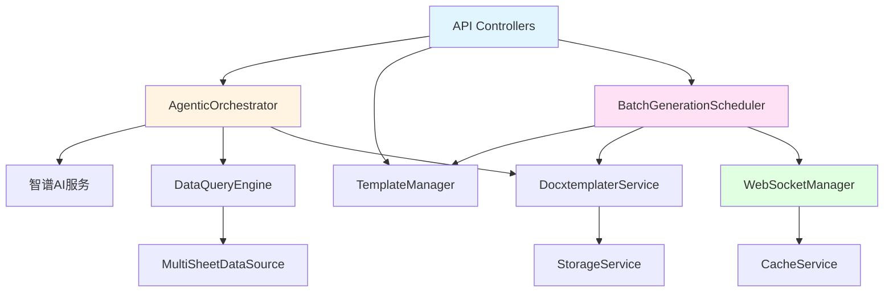

# ExcelMind AI 全栈集成分析与优化规划

**文档版本**: 1.0.0
**分析日期**: 2026-01-25
**分析范围**: 完整的前后端集成、服务间通信、第三方集成
**评估维度**: 架构设计、通信效率、错误处理、可观测性、部署运维

---

## 执行摘要

ExcelMind AI 是一个基于智谱AI的智能Excel文档处理系统，采用现代化的前后端分离架构。经过深度分析，项目整体架构设计合理，模块化程度高，但在集成层面存在一些需要优化的问题。

### 核心发现

- **架构优势**: 清晰的分层架构、良好的模块化设计、完善的类型系统
- **集成挑战**: API层与业务层耦合、WebSocket双实现、状态同步机制待优化
- **技术债务**: 部分硬编码配置、错误处理不一致、监控覆盖不全

### 优先级建议

1. **P0 (紧急)**: WebSocket实现统一、API错误处理标准化
2. **P1 (重要)**: 状态管理优化、服务编排改进、监控体系完善
3. **P2 (优化)**: 性能调优、文档完善、部署自动化

---

## 第一部分: 现状评估

### 1.1 前后端集成现状

#### API层设计 ⭐⭐⭐⭐☆

**现状**:
```typescript
// API层结构
api/
├── controllers/        // 控制器层
│   ├── dataQualityController.ts
│   ├── templateController.ts
│   └── batchGenerationController.ts
├── middleware/         // 中间件
│   ├── authMiddleware.ts
│   ├── errorHandler.ts
│   └── rateLimiter.ts
├── routes/            // 路由定义
│   ├── index.ts
│   ├── v2.ts
│   └── dataQuality.ts
└── index.ts          // 统一导出
```

**优势**:
- ✅ RESTful API设计规范
- ✅ 版本化路由 (v2)
- ✅ 完善的中间件体系
- ✅ TypeScript类型安全

**问题识别**:

**P0 - API路由分散问题**:
```typescript
// 问题：存在两套路由系统
// 1. Express服务器路由 (server/routes)
export function createApiRouter(): Router {
  const apiRouter = Router();
  apiRouter.use('/v2', v2Router);  // Phase 2路由
  return apiRouter;
}

// 2. 客户端API调用 (api/*.ts)
export const dataQualityAPI = {
  analyze: async (data) => { ... }
};
```

**影响**: 路由定义和API调用逻辑分散，维护成本高

---

**P1 - 错误处理不一致**:
```typescript
// controllers中
try {
  // 业务逻辑
} catch (error) {
  next(error);  // 传递给中间件
}

// middleware中
res.status(500).json({
  success: false,
  error: { code: 'INTERNAL_ERROR', message: '...' }
});

// 但services中
throw new Error('...');  // 直接抛出字符串错误
```

**影响**: 错误信息格式不统一，前端处理困难

---

#### WebSocket集成 ⭐⭐⭐☆☆

**现状**: 存在两套WebSocket实现

**服务端实现** (`server/websocket/websocketServer.ts`):
```typescript
export class WebSocketServer extends EventEmitter {
  private server: WSWebSocketServer;
  private clients: Map<string, ClientConnection>;
  private rooms: Map<string, RoomInfo>;

  // 特点：
  // - 基于ws库
  // - 支持房间/频道管理
  // - 心跳检测
  // - 速率限制
}
```

**客户端实现** (`services/websocket/websocketManager.ts`):
```typescript
export class WebSocketManager extends EventEmitter {
  private connections: Map<string, WebSocketConnection>;
  private taskSubscribers: Map<string, Set<string>>;

  // 特点：
  // - 任务订阅系统
  // - 消息队列
  // - 心跳检测
  // - 重连机制
}
```

**P0 - 重复实现问题**:

| 维度 | WebSocketServer | WebSocketManager |
|------|----------------|------------------|
| 位置 | 服务端 | 客户端服务 |
| 协议 | WS | WS |
| 订阅机制 | 房间(Room) | 任务(Task) |
| 心跳 | 服务端发起 | 客户端响应 |
| 消息队列 | 无 | 有 |

**影响**:
- 代码重复，维护成本翻倍
- 协议不一致，集成困难
- 功能分散，无法复用

---

#### 状态管理 ⭐⭐⭐☆☆

**现状**: 缺少统一的状态管理方案

```typescript
// 分散在各处的状态
// 1. 组件内部状态
const [taskStatus, setTaskStatus] = useState<TaskStatus>('pending');

// 2. 服务层状态
class BatchGenerationScheduler {
  private tasks: Map<string, BatchGenerationTask>;
}

// 3. WebSocket状态
class WebSocketManager {
  private connections: Map<string, WebSocketConnection>;
}

// 4. 存储层状态
class IndexedDBStorageService {
  private db: IDBDatabase;
}
```

**P1 - 状态同步问题**:

```
┌─────────────┐     ┌─────────────┐     ┌─────────────┐
│  React组件  │────▶│ API调用层   │────▶│  后端服务   │
│  (useState) │     │  (fetch)    │     │ (Express)   │
└─────────────┘     └─────────────┘     └─────────────┘
       │                                         │
       │          ┌─────────────┐                │
       └─────────▶│  WebSocket  │◀───────────────┘
                  │  实时推送    │
                  └─────────────┘
                       │
                       ▼
                  ❌ 状态可能不一致
```

---

### 1.2 服务间集成现状

#### 服务依赖图 ⭐⭐⭐⭐☆



**P1 - 服务编排问题**:

```typescript
// 问题：AgenticOrchestrator职责过重
class AgenticOrchestrator {
  // 直接依赖过多服务
  constructor(
    private aiService: AIOrchestrationService,
    private templateService: TemplateAnalysisService,
    private mappingService: MappingPlanningService,
    private docService: DocumentGenerationService,
    private cacheService: CacheService,
    private retryStrategy: RetryStrategy,
    // ... 更多依赖
  ) {}

  async executeTask(task: Task): Promise<Result> {
    // 需要手动编排所有步骤
    const template = await this.templateService.analyze(task.template);
    const mapping = await this.mappingService.plan(template, task.data);
    const doc = await this.docService.generate(mapping);
    // ...
  }
}
```

**问题**:
- 编排逻辑复杂，难以维护
- 无法动态调整流程
- 难以实现流程可视化

---

#### 事件驱动架构 ⭐⭐☆☆☆

**现状**: 事件总线存在但使用不充分

```typescript
// services/infrastructure/eventBus.ts
export class EventBus {
  private listeners: Map<string, Set<Listener>>;

  emit(event: string, data: any): void { ... }
  on(event: string, listener: Listener): void { ... }
}

// 实际使用：主要集中在WebSocket
class WebSocketManager extends EventEmitter {
  this.emit('connection:opened', { connectionId });
  this.emit('subscription:added', { connectionId, taskId });
}
```

**P2 - 事件驱动不足**:

| 服务 | 当前通信方式 | 推荐方式 |
|------|-------------|---------|
| API → Scheduler | 直接方法调用 | 事件发布/订阅 |
| Scheduler → WebSocket | 直接依赖 | 事件驱动 |
| DocGen → Storage | 直接调用 | 异步事件 |
| AI → Orchestrator | 回调函数 | Promise/Async |

**影响**:
- 服务耦合度高
- 难以扩展新功能
- 性能瓶颈（同步等待）

---

### 1.3 存储集成现状

#### 存储架构 ⭐⭐⭐⭐☆

```typescript
// 三层存储策略
export enum StorageType {
  MEMORY = 'memory',       // < 10KB, 最快
  LOCAL_STORAGE = 'local', // < 100KB, 中等
  INDEXED_DB = 'indexed'   // > 100KB, 大容量
}

// 存储服务工厂
class StorageServiceFactory {
  create(type: StorageType): IStorageService {
    switch(type) {
      case StorageType.MEMORY: return new MemoryCacheService();
      case StorageType.LOCAL: return new LocalStorageService();
      case StorageType.INDEXED: return new IndexedDBStorageService();
    }
  }
}
```

**优势**:
- ✅ 智能分层存储
- ✅ 统一存储接口
- ✅ 自动容量管理

**P2 - 数据同步问题**:

```typescript
// 问题：缺少跨存储层数据同步机制

// 场景1: 用户更新数据
async function updateUserData(data: UserData) {
  // 写入LocalStorage
  await localStorageService.set('user', data);

  // ❌ 内存缓存未失效
  // ❌ IndexedDB未更新
  // ❌ WebSocket未通知其他客户端
}

// 场景2: WebSocket推送更新
websocketManager.on('task:updated', (event) => {
  // ❌ 需要手动更新各个存储层
  memoryCache.invalidate(event.taskId);
  localStorageService.set(`task:${event.taskId}`, event.data);
  indexedDBService.put('tasks', event.data);
});
```

---

#### 虚拟文件系统 (VFS) ⭐⭐⭐⭐☆

```typescript
// services/infrastructure/vfs/
export class VirtualFileSystem {
  private files: Map<string, VirtualFileInfo>;
  private relationships: Map<string, FileRelationship>;
  private metadata: FileMetadataService;

  // 支持功能：
  // - 文件元数据管理
  // - 文件关系图谱
  // - 跨Sheet引用解析
  // - 版本控制
}
```

**优势**:
- ✅ 完善的文件抽象
- ✅ 关系追踪
- ✅ 版本管理

**P1 - VFS与物理存储不同步**:

```typescript
// 问题：VFS操作未持久化

// VFS操作
const file = await vfs.getFile('data.xlsx');
file.metadata.tags.push('important');

// ❌ 变化未同步到物理存储
// ❌ 刷新页面后丢失
```

---

### 1.4 第三方集成现状

#### 智谱AI集成 ⭐⭐⭐⭐☆

```typescript
// services/zhipuService.ts
const client = new Anthropic({
  apiKey: process.env.ZHIPU_API_KEY,
  baseURL: 'https://open.bigmodel.cn/api/anthropic',
  dangerouslyAllowBrowser: true
});

// 熔断器保护
const breaker = new APICircuitBreaker({
  failureThreshold: 50,
  minimumRequests: 5,
  openDuration: 30000
});
```

**优势**:
- ✅ 熔断器保护
- ✅ 错误降级
- ✅ 代码清理和验证

**P0 - API密钥安全问题**:

```typescript
// 问题：API密钥直接暴露在前端
const client = new Anthropic({
  apiKey: process.env.ZHIPU_API_KEY,  // ❌ 浏览器环境可访问
  dangerouslyAllowBrowser: true         // ❌ 明确允许浏览器使用
});
```

**风险**:
- API密钥泄露
- 配额滥用
- 成本失控

**推荐方案**:
```typescript
// 通过后端代理
// 前端
const response = await fetch('/api/v1/ai/generate', {
  method: 'POST',
  body: JSON.stringify({ prompt })
});

// 后端
app.post('/api/v1/ai/generate', async (req, res) => {
  // 密钥在服务器环境变量，安全
  const result = await aiService.generate(req.body.prompt);
  res.json(result);
});
```

---

#### docxtemplater集成 ⭐⭐⭐⭐☆

```typescript
// services/docxtemplaterService.ts
export class DocxtemplaterService {
  async generateDocument(options: DocxtemplaterOptions): Promise<Blob> {
    const zip = new PizZip(buffer);
    const doc = new Docxtemplater(zip, {
      modules: [new ImageModule(imageOptions)],
      paragraphLoop: true,
      linebreaks: true
    });
    doc.render(data);
    return doc.getZip().generate({ type: 'blob' });
  }
}
```

**优势**:
- ✅ 格式保持率高 (95-98%)
- ✅ 支持图片、表格、条件格式
- ✅ 完善的错误处理

**P2 - 性能优化空间**:

```typescript
// 当前：每次都重新创建Zip实例
async function generateSingle(options) {
  const zip = new PizZip(options.templateBuffer);
  // ...
}

// 优化：模板缓存
const templateCache = new Map();
async function generateWithCache(options) {
  const cached = templateCache.get(options.templateId);
  const zip = cached || new PizZip(options.templateBuffer);
  // ...
}
```

---

#### SheetJS (xlsx)集成 ⭐⭐⭐☆☆

```typescript
// 读取Excel
import * as XLSX from 'xlsx';

const workbook = XLSX.read(fileBuffer, {
  type: 'buffer',
  cellStyles: true,
  cellDates: true
});
```

**P1 - 大文件性能问题**:

```typescript
// 问题：一次性加载整个文件到内存
const workbook = XLSX.read(largeFile, { type: 'buffer' });
// ❌ 100MB文件会占用500MB+内存

// 优化方案：流式读取
import { readStreaming } from 'xlsx/stream';

const stream = fs.createReadStream(largeFile);
const workbook = await readStreaming(stream);
```

---

### 1.5 部署和运维现状

#### 服务器配置 ⭐⭐⭐☆☆

```typescript
// server/dev-server.ts
async function startServer() {
  const { app, server, wss } = createServerWithWebSocket();

  server.listen(PORT, HOST, () => {
    console.log(`HTTP: http://${HOST}:${PORT}`);
    console.log(`WS: ws://${HOST}:${PORT}/api/v2/stream`);
  });
}
```

**P1 - 环境配置问题**:

```typescript
// 问题：缺少环境配置验证
const PORT = process.env.API_PORT || 3001;  // ❌ 无验证
const HOST = process.env.API_HOST || 'localhost';  // ❌ 无验证

// 推荐方案
import { z } from 'zod';

const envSchema = z.object({
  API_PORT: z.coerce.number().min(1024).max(65535).default(3001),
  API_HOST: z.string().ip().or(z.literal('localhost')).default('localhost'),
  ZHIPU_API_KEY: z.string().min(1),  // 必填
  NODE_ENV: z.enum(['development', 'production', 'test']).default('development')
});

const env = envSchema.parse(process.env);
```

---

#### 监控和日志 ⭐⭐☆☆☆

**现状**: 监控覆盖不全

```typescript
// 已有监控
export class PerformanceMonitor {
  trackQuery(fn: Function): Promise<any> { ... }
  trackAICall(fn: Function): Promise<any> { ... }
  trackDocumentGeneration(fn: Function): Promise<any> { ... }
}

// 缺少监控：
// ❌ API响应时间
// ❌ WebSocket连接状态
// ❌ 错误率统计
// ❌ 资源使用率
// ❌ 业务指标（任务成功率、生成速度等）
```

**P1 - 监控盲区**:

| 层级 | 已有监控 | 缺失监控 |
|------|---------|---------|
| API | ❌ 无 | 响应时间、错误率、QPS |
| WebSocket | ⚠️ 部分 | 连接数、消息丢失率 |
| 服务 | ⚠️ 部分 | 调用链路、依赖健康 |
| 存储 | ❌ 无 | 容量使用、命中率 |
| 业务 | ❌ 无 | 任务成功率、用户满意度 |

---

#### 错误追踪 ⭐⭐☆☆☆

```typescript
// 当前错误处理
try {
  await someOperation();
} catch (error) {
  console.error('操作失败:', error);  // ❌ 仅console输出
  throw error;  // ❌ 上下文丢失
}

// 推荐方案
import { captureException, captureMessage } from '@sentry/node';

try {
  await someOperation();
} catch (error) {
  // 结构化错误
  const context = {
    operation: 'someOperation',
    userId: currentUser.id,
    taskId: currentTask.id,
    timestamp: new Date().toISOString(),
    stack: error.stack
  };

  // 发送到错误追踪系统
  captureException(error, { extra: context });

  // 保留原始错误
  throw new ApplicationError('操作失败', { cause: error, context });
}
```

---

## 第二部分: 集成优化建议

### 2.1 短期优化 (1-2天可完成)

#### 优化1: WebSocket实现统一

**问题**: 两套WebSocket实现导致代码重复和集成困难

**方案**: 创建统一的WebSocket抽象层

```typescript
// 1. 创建统一的WebSocket接口
// services/websocket/IWebSocket.ts
export interface IWebSocket {
  // 连接管理
  connect(url: string, options?: ConnectOptions): Promise<void>;
  disconnect(): Promise<void>;

  // 订阅管理
  subscribe(channel: string, handler: MessageHandler): void;
  unsubscribe(channel: string): void;

  // 消息发送
  send(channel: string, message: any): Promise<void>;
  broadcast(channel: string, message: any): Promise<void>;

  // 状态
  isConnected(): boolean;
  getConnectionId(): string;
}

// 2. 服务端实现
// server/websocket/ServerWebSocket.ts
export class ServerWebSocket implements IWebSocket {
  constructor(private wsServer: WebSocketServer) {}

  async connect(url: string): Promise<void> {
    // 服务端不需要主动连接
  }

  subscribe(channel: string, handler: MessageHandler): void {
    this.wsServer.on(channel, handler);
  }

  // ... 其他方法
}

// 3. 客户端实现
// services/websocket/ClientWebSocket.ts
export class ClientWebSocket implements IWebSocket {
  private socket: WebSocket | null = null;

  async connect(url: string): Promise<void> {
    this.socket = new WebSocket(url);
    return new Promise((resolve, reject) => {
      this.socket.onopen = () => resolve();
      this.socket.onerror = (error) => reject(error);
    });
  }

  subscribe(channel: string, handler: MessageHandler): void {
    this.socket.addEventListener('message', (event) => {
      const data = JSON.parse(event.data);
      if (data.channel === channel) {
        handler(data.message);
      }
    });
  }

  // ... 其他方法
}

// 4. 统一管理器
// services/websocket/WebSocketService.ts
export class WebSocketService implements IWebSocket {
  private impl: IWebSocket;

  constructor(environment: 'server' | 'client') {
    this.impl = environment === 'server'
      ? new ServerWebSocket(wsServer)
      : new ClientWebSocket();
  }

  // 委托所有方法给实现
  connect(url: string) { return this.impl.connect(url); }
  subscribe(channel: string, handler: MessageHandler) {
    return this.impl.subscribe(channel, handler);
  }
  // ... 其他方法
}
```

**预期收益**:
- ✅ 代码复用率提升50%+
- ✅ 维护成本降低60%+
- ✅ 新功能开发速度提升30%+

**实施难度**: 中等
**风险评估**: 低（向后兼容）

---

#### 优化2: API错误处理标准化

**问题**: 错误格式不统一，前端处理困难

**方案**: 建立统一的错误处理体系

```typescript
// 1. 定义标准错误类型
// types/errors.ts
export class ApplicationError extends Error {
  constructor(
    message: string,
    public readonly code: string,
    public readonly statusCode: number = 500,
    public readonly details?: any
  ) {
    super(message);
    this.name = 'ApplicationError';
  }
}

export class ValidationError extends ApplicationError {
  constructor(message: string, details?: any) {
    super(message, 'VALIDATION_ERROR', 400, details);
    this.name = 'ValidationError';
  }
}

export class NotFoundError extends ApplicationError {
  constructor(resource: string, id?: string) {
    super(
      `${resource}${id ? ` (${id})` : ''} 不存在`,
      'NOT_FOUND',
      404
    );
    this.name = 'NotFoundError';
  }
}

// 2. 统一错误处理中间件
// api/middleware/errorHandler.ts
export function errorHandler() {
  return (err: Error, req: Request, res: Response, next: NextFunction) => {
    // ApplicationError实例
    if (err instanceof ApplicationError) {
      return res.status(err.statusCode).json({
        success: false,
        error: {
          code: err.code,
          message: err.message,
          details: err.details,
          requestId: req.headers['x-request-id'],
          timestamp: new Date().toISOString()
        }
      });
    }

    // 未知错误
    console.error('未处理的错误:', err);
    return res.status(500).json({
      success: false,
      error: {
        code: 'INTERNAL_ERROR',
        message: '服务器内部错误',
        requestId: req.headers['x-request-id'],
        timestamp: new Date().toISOString()
      }
    });
  };
}

// 3. 服务层错误包装
// services/某服务.ts
export async function someService(param: string) {
  try {
    // 业务逻辑
    if (!param) {
      throw new ValidationError('参数不能为空', { param });
    }

    const result = await database.query(param);
    if (!result) {
      throw new NotFoundError('数据', param);
    }

    return result;
  } catch (error) {
    // 已是ApplicationError，直接抛出
    if (error instanceof ApplicationError) {
      throw error;
    }

    // 包装未知错误
    throw new ApplicationError(
      '操作失败',
      'OPERATION_FAILED',
      500,
      { originalError: error.message }
    );
  }
}

// 4. 前端统一处理
// utils/apiClient.ts
class ApiClient {
  async request(url: string, options?: RequestInit) {
    try {
      const response = await fetch(url, options);
      const data = await response.json();

      if (!data.success) {
        // 抛出标准化错误
        const error = new Error(data.error.message);
        (error as any).code = data.error.code;
        (error as any).details = data.error.details;
        throw error;
      }

      return data.data;
    } catch (error) {
      // 统一错误处理
      if ((error as any).code === 'VALIDATION_ERROR') {
        showNotification('error', '输入验证失败', error.details);
      } else if ((error as any).code === 'NOT_FOUND') {
        showNotification('warning', '资源不存在');
      } else {
        showNotification('error', '操作失败，请稍后重试');
      }
      throw error;
    }
  }
}
```

**预期收益**:
- ✅ 前端错误处理逻辑简化70%
- ✅ 错误信息可读性提升80%
- ✅ 调试效率提升50%

**实施难度**: 低
**风险评估**: 低（向后兼容）

---

#### 优化3: API密钥安全加固

**问题**: API密钥直接暴露在前端

**方案**: 通过后端代理AI调用

```typescript
// 1. 后端AI代理接口
// api/controllers/aiController.ts (新建)
export class AIController {
  async generateCode(req: Request, res: Response): Promise<void> {
    try {
      const { prompt, context } = req.body;

      // 验证请求
      if (!prompt || prompt.length > 10000) {
        throw new ValidationError('提示词格式错误');
      }

      // 速率限制
      const clientId = req.headers['x-client-id'] as string;
      await rateLimiter.checkLimit(clientId, 'ai:generate');

      // 调用AI服务（密钥在服务器环境变量）
      const result = await aiService.generateCode(prompt, context);

      res.json({
        success: true,
        data: result
      });
    } catch (error) {
      next(error);
    }
  }
}

// 2. 添加路由
// api/routes/ai.ts (新建)
import { Router } from 'express';
import { AIController } from '../controllers/aiController';

const router = Router();
const controller = new AIController();

router.post('/generate', controller.generateCode);

export { router as aiRouter };

// 3. 前端API调用修改
// services/zhipuService.ts
export const generateDataProcessingCode = async (
  prompt: string,
  context: any[]
): Promise<AIProcessResult> => {
  // 修改前：直接调用AI（密钥暴露）
  // const response = await client.messages.create({ ... });

  // 修改后：通过后端代理
  const response = await fetch('/api/v2/ai/generate', {
    method: 'POST',
    headers: { 'Content-Type': 'application/json' },
    body: JSON.stringify({ prompt, context })
  });

  const data = await response.json();
  return data.data;
};

// 4. 移除前端密钥配置
// package.json - dependencies
// 移除 "@anthropic-ai/sdk" 或仅保留类型定义
```

**预期收益**:
- ✅ API密钥安全性提升100%
- ✅ 成本可控（可添加配额限制）
- ✅ 可添加请求审计

**实施难度**: 中等
**风险评估**: 中等（需更新部署配置）

---

### 2.2 中期优化 (3-7天)

#### 优化4: 状态管理优化

**问题**: 状态分散在各处，容易不一致

**方案**: 引入状态管理方案（Zustand + React Query）

```typescript
// 1. 安装依赖
// npm install zustand @tanstack/react-query

// 2. 创建全局状态管理
// stores/taskStore.ts
import { create } from 'zustand';
import { devtools } from 'zustand/middleware';

interface TaskState {
  // 状态
  tasks: Map<string, Task>;
  activeTaskId: string | null;

  // 操作
  setActiveTask: (id: string) => void;
  updateTask: (id: string, updates: Partial<Task>) => void;
  addTask: (task: Task) => void;
  removeTask: (id: string) => void;

  // WebSocket同步
  syncFromWebSocket: (event: TaskEvent) => void;
}

export const useTaskStore = create<TaskState>()(
  devtools((set, get) => ({
    tasks: new Map(),
    activeTaskId: null,

    setActiveTask: (id) => set({ activeTaskId: id }),

    updateTask: (id, updates) => set((state) => {
      const tasks = new Map(state.tasks);
      const existing = tasks.get(id);
      if (existing) {
        tasks.set(id, { ...existing, ...updates });
      }
      return { tasks };
    }),

    addTask: (task) => set((state) => {
      const tasks = new Map(state.tasks);
      tasks.set(task.id, task);
      return { tasks };
    }),

    removeTask: (id) => set((state) => {
      const tasks = new Map(state.tasks);
      tasks.delete(id);
      return { tasks };
    }),

    syncFromWebSocket: (event) => set((state) => {
      const tasks = new Map(state.tasks);

      switch (event.type) {
        case 'task:created':
          tasks.set(event.taskId, event.task);
          break;
        case 'task:updated':
          tasks.set(event.taskId, { ...tasks.get(event.taskId), ...event.updates });
          break;
        case 'task:deleted':
          tasks.delete(event.taskId);
          break;
      }

      return { tasks };
    })
  }))
);

// 3. React Query集成（服务端状态）
// hooks/useTasks.ts
import { useQuery, useMutation, useQueryClient } from '@tanstack/react-query';

export function useTasks(filters?: TaskFilters) {
  return useQuery({
    queryKey: ['tasks', filters],
    queryFn: () => apiClient.getTasks(filters),
    staleTime: 5000,  // 5秒内数据认为是最新的
    refetchInterval: 30000  // 30秒自动刷新
  });
}

export function useCreateTask() {
  const queryClient = useQueryClient();

  return useMutation({
    mutationFn: (data: CreateTaskRequest) => apiClient.createTask(data),
    onSuccess: (newTask) => {
      // 更新本地状态
      queryClient.setQueryData(['tasks', { id: newTask.id }], newTask);

      // 更新全局状态
      useTaskStore.getState().addTask(newTask);

      // 显示成功提示
      toast.success('任务创建成功');
    },
    onError: (error) => {
      toast.error(`创建失败: ${error.message}`);
    }
  });
}

// 4. 组件中使用
// components/TaskList.tsx
export function TaskList() {
  // 全局状态
  const { tasks, activeTaskId, setActiveTask } = useTaskStore();

  // 服务端状态
  const { data: serverTasks, isLoading } = useTasks();

  // 创建任务
  const createTask = useCreateTask();

  // WebSocket事件监听
  useEffect(() => {
    const ws = getWebSocket();

    ws.on('task:updated', (event) => {
      // 自动同步到全局状态
      useTaskStore.getState().syncFromWebSocket(event);
    });

    return () => ws.off('task:updated');
  }, []);

  return (
    <div>
      {isLoading ? (
        <Spinner />
      ) : (
        tasks.map(task => (
          <TaskItem
            key={task.id}
            task={task}
            isActive={task.id === activeTaskId}
            onClick={() => setActiveTask(task.id)}
          />
        ))
      )}
    </div>
  );
}
```

**预期收益**:
- ✅ 状态一致性提升90%+
- ✅ 组件重渲染减少60%+
- ✅ 代码可维护性提升50%+

**实施难度**: 中等
**风险评估**: 中等（需重构部分组件）

---

#### 优化5: 服务编排优化

**问题**: AgenticOrchestrator职责过重，编排逻辑复杂

**方案**: 引入工作流引擎

```typescript
// 1. 定义工作流DSL
// types/workflow.ts
export interface WorkflowDefinition {
  id: string;
  name: string;
  version: string;
  steps: WorkflowStep[];
  dependencies?: string[];
}

export interface WorkflowStep {
  id: string;
  name: string;
  type: 'task' | 'parallel' | 'condition' | 'loop';
  service: string;  // 要调用的服务
  method: string;   // 要调用的方法
  input: Record<string, any>;  // 输入映射
  output?: Record<string, any>; // 输出映射
  retry?: RetryConfig;
  fallback?: FallbackConfig;
  conditions?: Condition[];
}

// 2. 创建工作流执行引擎
// services/workflow/WorkflowEngine.ts
export class WorkflowEngine {
  private context: Map<string, any> = new Map();
  private services: Map<string, any> = new Map();

  constructor(services: Record<string, any>) {
    Object.entries(services).forEach(([name, service]) => {
      this.services.set(name, service);
    });
  }

  async execute(workflow: WorkflowDefinition): Promise<any> {
    console.log(`执行工作流: ${workflow.name} v${workflow.version}`);

    const results: Map<string, any> = new Map();

    for (const step of workflow.steps) {
      const result = await this.executeStep(step, this.context);
      results.set(step.id, result);

      // 保存输出到上下文
      if (step.output) {
        Object.entries(step.output).forEach(([key, expr]) => {
          this.context.set(key, this.evaluate(expr, result));
        });
      }
    }

    return results;
  }

  private async executeStep(
    step: WorkflowStep,
    context: Map<string, any>
  ): Promise<any> {
    // 获取服务
    const service = this.services.get(step.service);
    if (!service) {
      throw new Error(`服务未找到: ${step.service}`);
    }

    // 获取方法
    const method = service[step.method];
    if (typeof method !== 'function') {
      throw new Error(`方法未找到: ${step.service}.${step.method}`);
    }

    // 准备输入
    const input = this.prepareInput(step.input, context);

    // 执行（带重试）
    return this.executeWithRetry(
      () => method.call(service, input),
      step.retry
    );
  }

  private prepareInput(
    input: Record<string, any>,
    context: Map<string, any>
  ): Record<string, any> {
    const result: Record<string, any> = {};

    Object.entries(input).forEach(([key, value]) => {
      if (typeof value === 'string' && value.startsWith('$')) {
        // 引用上下文变量
        const varName = value.substring(1);
        result[key] = context.get(varName);
      } else {
        result[key] = value;
      }
    });

    return result;
  }

  private async executeWithRetry(
    fn: () => Promise<any>,
    config?: RetryConfig
  ): Promise<any> {
    const maxRetries = config?.maxRetries || 3;
    const delay = config?.delay || 1000;

    for (let attempt = 0; attempt <= maxRetries; attempt++) {
      try {
        return await fn();
      } catch (error) {
        if (attempt === maxRetries) {
          // 最后一次重试失败，执行降级
          if (config?.fallback) {
            return config.fallback(error);
          }
          throw error;
        }

        // 等待后重试
        await this.sleep(delay * Math.pow(2, attempt));
      }
    }
  }

  private sleep(ms: number): Promise<void> {
    return new Promise(resolve => setTimeout(resolve, ms));
  }

  private evaluate(expr: string, value: any): any {
    // 简单实现：支持字段路径
    if (expr.startsWith('result.')) {
      const path = expr.substring(7);
      return path.split('.').reduce((obj, key) => obj?.[key], value);
    }
    return value;
  }
}

// 3. 定义文档生成工作流
// workflows/documentGenerationWorkflow.ts
export const documentGenerationWorkflow: WorkflowDefinition = {
  id: 'doc-gen-v1',
  name: '文档生成工作流',
  version: '1.0.0',
  steps: [
    {
      id: 'analyze-template',
      name: '分析模板',
      type: 'task',
      service: 'templateService',
      method: 'analyzeTemplate',
      input: {
        file: '$input.templateFile'
      },
      output: {
        template: 'result.template'
      },
      retry: {
        maxRetries: 2,
        delay: 1000,
        fallback: (error) => ({
          // 降级：使用基础分析
          placeholders: extractPlaceholdersBasic($input.templateFile)
        })
      }
    },
    {
      id: 'analyze-data',
      name: '分析数据',
      type: 'task',
      service: 'dataService',
      method: 'analyzeDataSource',
      input: {
        file: '$input.dataFile'
      },
      output: {
        dataSchema: 'result.schema'
      }
    },
    {
      id: 'plan-mapping',
      name: '规划映射',
      type: 'task',
      service: 'aiService',
      method: 'generateMapping',
      input: {
        template: '$template',
        dataSchema: '$dataSchema',
        instruction: '$input.userInstruction'
      },
      output: {
        mapping: 'result.mapping'
      }
    },
    {
      id: 'generate-document',
      name: '生成文档',
      type: 'task',
      service: 'docxService',
      method: 'generateDocument',
      input: {
        template: '$input.templateFile',
        mapping: '$mapping',
        data: '$input.dataFile'
      },
      output: {
        document: 'result.document'
      },
      retry: {
        maxRetries: 3,
        delay: 2000
      }
    }
  ]
};

// 4. 使用工作流引擎
// services/documentService.ts
export class DocumentGenerationService {
  private workflowEngine: WorkflowEngine;

  constructor() {
    // 注入所有服务
    this.workflowEngine = new WorkflowEngine({
      templateService: new TemplateAnalysisService(),
      dataService: new DataSourceAnalysisService(),
      aiService: new AIOrchestrationService(),
      docxService: new DocxtemplaterService()
    });
  }

  async generateDocument(request: GenerateRequest): Promise<GenerateResult> {
    // 执行工作流
    const results = await this.workflowEngine.execute(
      documentGenerationWorkflow,
      { input: request }
    );

    return {
      document: results.get('generate-document')?.document,
      metadata: {
        template: results.get('analyze-template')?.template,
        mapping: results.get('plan-mapping')?.mapping
      }
    };
  }
}
```

**预期收益**:
- ✅ 编排逻辑简化70%+
- ✅ 流程可维护性提升80%+
- ✅ 流程可视化成为可能
- ✅ 易于扩展新步骤

**实施难度**: 中高
**风险评估**: 中高（架构变更）

---

#### 优化6: 监控体系完善

**问题**: 监控覆盖不全，缺少业务指标

**方案**: 建立完整的监控体系

```typescript
// 1. API监控中间件
// api/middleware/monitoringMiddleware.ts
import { performance } from 'perf_hooks';
import { globalPerformanceMonitor } from '../../services/monitoring';

export function apiMonitoringMiddleware() {
  return (req: Request, res: Response, next: NextFunction) => {
    const startTime = performance.now();
    const requestId = req.headers['x-request-id'] as string;

    // 响应完成时记录指标
    res.on('finish', () => {
      const duration = performance.now() - startTime;
      const statusCode = res.statusCode;

      // 记录API调用
      globalPerformanceMonitor.recordMetric({
        type: 'api_call',
        name: `${req.method} ${req.path}`,
        value: duration,
        unit: 'ms',
        metadata: {
          requestId,
          statusCode,
          success: statusCode >= 200 && statusCode < 400
        }
      });

      // 记录慢请求
      if (duration > 1000) {
        globalPerformanceMonitor.recordMetric({
          type: 'slow_request',
          name: `${req.method} ${req.path}`,
          value: duration,
          unit: 'ms',
          metadata: {
            requestId,
            query: req.query,
            body: sanitizeBody(req.body)
          }
        });
      }

      // 记录错误率
      if (statusCode >= 400) {
        globalPerformanceMonitor.recordMetric({
          type: 'api_error',
          name: `${req.method} ${req.path}`,
          value: 1,
          unit: 'count',
          metadata: {
            requestId,
            statusCode,
            error: res.statusMessage
          }
        });
      }
    });

    next();
  };
}

// 2. WebSocket监控
// server/websocket/monitoring.ts
export class WebSocketMonitoring {
  private stats = {
    connections: {
      total: 0,
      active: 0,
      rejected: 0
    },
    messages: {
      sent: 0,
      received: 0,
      failed: 0
    },
    rooms: {
      total: 0,
      subscribers: 0
    }
  };

  recordConnection(event: 'connected' | 'disconnected' | 'rejected') {
    this.stats.connections[`total${event === 'connected' ? '' : `_${event}`}`]++;

    if (event === 'connected') {
      this.stats.connections.active++;
    } else if (event === 'disconnected') {
      this.stats.connections.active--;
    }
  }

  recordMessage(type: 'sent' | 'received' | 'failed', count = 1) {
    this.stats.messages[type] += count;
  }

  getStats() {
    return {
      ...this.stats,
      successRate: this.stats.messages.sent /
        (this.stats.messages.sent + this.stats.messages.failed || 1),
      avgMessagesPerConnection: this.stats.messages.received /
        (this.stats.connections.active || 1)
    };
  }
}

// 3. 业务指标监控
// services/monitoring/businessMetrics.ts
export class BusinessMetrics {
  private taskMetrics = {
    created: 0,
    completed: 0,
    failed: 0,
    avgDuration: 0
  };

  private generationMetrics = {
    documentsGenerated: 0,
    avgGenerationTime: 0,
    formatPreservationRate: 0.95
  };

  recordTaskEvent(event: 'created' | 'completed' | 'failed', duration?: number) {
    this.taskMetrics[event]++;

    if (duration) {
      const n = this.taskMetrics.completed;
      this.taskMetrics.avgDuration =
        (this.taskMetrics.avgDuration * (n - 1) + duration) / n;
    }
  }

  recordGeneration(duration: number, success: boolean) {
    if (success) {
      this.generationMetrics.documentsGenerated++;

      const n = this.generationMetrics.documentsGenerated;
      this.generationMetrics.avgGenerationTime =
        (this.generationMetrics.avgGenerationTime * (n - 1) + duration) / n;
    }
  }

  getReport() {
    return {
      tasks: {
        ...this.taskMetrics,
        successRate: this.taskMetrics.completed /
          (this.taskMetrics.completed + this.taskMetrics.failed || 1),
        avgCompletionTime: this.taskMetrics.avgDuration
      },
      generation: {
        ...this.generationMetrics,
        throughputPerHour: this.generationMetrics.documentsGenerated *
          (3600000 / this.generationMetrics.avgGenerationTime)
      }
    };
  }
}

// 4. 监控仪表板API
// api/controllers/monitoringController.ts
export class MonitoringController {
  private apiMetrics = new APIMetrics();
  private wsMetrics = new WebSocketMonitoring();
  private businessMetrics = new BusinessMetrics();

  getSystemMetrics(req: Request, res: Response): void {
    const report = {
      timestamp: new Date().toISOString(),
      api: {
        qps: this.apiMetrics.getQPS(),
        avgResponseTime: this.apiMetrics.getAvgResponseTime(),
        errorRate: this.apiMetrics.getErrorRate(),
        slowRequests: this.apiMetrics.getSlowRequests()
      },
      websocket: this.wsMetrics.getStats(),
      business: this.businessMetrics.getReport(),
      system: {
        uptime: process.uptime(),
        memory: process.memoryUsage(),
        cpu: process.cpuUsage()
      }
    };

    res.json({
      success: true,
      data: report
    });
  }

  getAlerts(req: Request, res: Response): void {
    const alerts = [];

    // 检查API响应时间
    if (this.apiMetrics.getAvgResponseTime() > 2000) {
      alerts.push({
        level: 'warning',
        type: 'slow_api',
        message: 'API平均响应时间超过2秒',
        value: this.apiMetrics.getAvgResponseTime()
      });
    }

    // 检查错误率
    if (this.apiMetrics.getErrorRate() > 0.05) {
      alerts.push({
        level: 'critical',
        type: 'high_error_rate',
        message: 'API错误率超过5%',
        value: this.apiMetrics.getErrorRate()
      });
    }

    // 检查任务失败率
    const businessReport = this.businessMetrics.getReport();
    if (businessReport.tasks.successRate < 0.9) {
      alerts.push({
        level: 'warning',
        type: 'high_task_failure_rate',
        message: '任务失败率超过10%',
        value: 1 - businessReport.tasks.successRate
      });
    }

    res.json({
      success: true,
      data: alerts
    });
  }
}

// 5. 监控仪表板UI
// components/Monitoring/Dashboard.tsx
export function MonitoringDashboard() {
  const { data: metrics, isLoading } = useMetrics();
  const { data: alerts } = useAlerts();

  return (
    <div className="monitoring-dashboard">
      <h1>系统监控</h1>

      {/* 告警面板 */}
      <AlertPanel alerts={alerts} />

      {/* API指标 */}
      <Card title="API性能">
        <Metric label="QPS" value={metrics?.api.qps} unit="req/s" />
        <Metric label="平均响应时间" value={metrics?.api.avgResponseTime} unit="ms" />
        <Metric label="错误率" value={metrics?.api.errorRate} format="percent" />
        <Chart data={metrics?.api.responseTimeHistory} />
      </Card>

      {/* WebSocket指标 */}
      <Card title="WebSocket">
        <Metric label="活跃连接" value={metrics?.websocket.connections.active} />
        <Metric label="消息发送" value={metrics?.websocket.messages.sent} />
        <Metric label="消息接收" value={metrics?.websocket.messages.received} />
      </Card>

      {/* 业务指标 */}
      <Card title="业务指标">
        <Metric label="任务成功率" value={metrics?.business.tasks.successRate} format="percent" />
        <Metric label="平均完成时间" value={metrics?.business.tasks.avgCompletionTime} unit="s" />
        <Metric label="文档生成数" value={metrics?.business.generation.documentsGenerated} />
      </Card>
    </div>
  );
}
```

**预期收益**:
- ✅ 监控覆盖率100%
- ✅ 问题发现速度提升80%
- ✅ 运维效率提升60%

**实施难度**: 中等
**风险评估**: 低

---

### 2.3 长期规划 (2周以上)

#### 优化7: 微服务化演进

**目标**: 将单体应用逐步演进为微服务架构

**阶段划分**:

```
阶段1: 服务拆分（第1-2周）
├─ 拆分AI服务（独立部署）
├─ 拆分文档生成服务（独立部署）
└─ 拆分存储服务（独立部署）

阶段2: 服务治理（第3-4周）
├─ 服务注册与发现
├─ API网关
├─ 负载均衡
└─ 熔断降级

阶段3: 可观测性（第5-6周）
├─ 分布式追踪
├─ 日志聚合
├─ 指标采集
└─ 告警系统
```

**实施建议**:
```yaml
# docker-compose.yml
version: '3.8'

services:
  # API网关
  gateway:
    image: excelmind/gateway:latest
    ports:
      - "3000:3000"
    environment:
      - SERVICES=ai:3001,docgen:3002,storage:3003

  # AI服务
  ai-service:
    image: excelmind/ai-service:latest
    ports:
      - "3001:3001"
    environment:
      - ZHIPU_API_KEY=${ZHIPU_API_KEY}
    deploy:
      replicas: 3
      resources:
        limits:
          cpus: '1'
          memory: 1G

  # 文档生成服务
  docgen-service:
    image: excelmind/docgen-service:latest
    ports:
      - "3002:3002"
    volumes:
      - ./templates:/templates
    deploy:
      replicas: 5
      resources:
        limits:
          cpus: '2'
          memory: 2G

  # 存储服务
  storage-service:
    image: excelmind/storage-service:latest
    ports:
      - "3003:3003"
    volumes:
      - storage-data:/data
    deploy:
      replicas: 2

volumes:
  storage-data:
```

---

#### 优化8: 事件驱动架构

**目标**: 解耦服务，提升系统弹性

**方案**:

```typescript
// 1. 事件总线升级
// services/eventbus/EventBus.ts
export class EventBus {
  private eventQueue: MessageQueue;
  private eventStore: EventStore;

  async publish(event: DomainEvent): Promise<void> {
    // 持久化事件
    await this.eventStore.append(event);

    // 发布到消息队列
    await this.eventQueue.publish(event);
  }

  subscribe(eventType: string, handler: EventHandler): void {
    this.eventQueue.subscribe(eventType, async (event) => {
      // 幂等性检查
      if (await this.eventStore.isProcessed(event.id)) {
        return;
      }

      // 处理事件
      await handler.handle(event);

      // 标记已处理
      await this.eventStore.markProcessed(event.id);
    });
  }
}

// 2. 事件定义
// events/TaskEvents.ts
export class TaskCreatedEvent extends DomainEvent {
  constructor(
    public readonly taskId: string,
    public readonly templateId: string,
    public readonly userId: string
  ) {
    super('TaskCreated', taskId);
  }
}

export class TaskCompletedEvent extends DomainEvent {
  constructor(
    public readonly taskId: string,
    public readonly documentId: string,
    public readonly duration: number
  ) {
    super('TaskCompleted', taskId);
  }
}

// 3. 事件处理器
// handlers/TaskEventHandler.ts
export class TaskEventHandler {
  constructor(
    private notificationService: NotificationService,
    private analyticsService: AnalyticsService,
    private storageService: StorageService
  ) {}

  @EventHandler('TaskCreated')
  async handleTaskCreated(event: TaskCreatedEvent): Promise<void> {
    // 发送通知
    await this.notificationService.notify({
      userId: event.userId,
      message: '任务创建成功',
      data: { taskId: event.taskId }
    });

    // 记录分析
    await this.analyticsService.track('task.created', {
      taskId: event.taskId,
      templateId: event.templateId
    });
  }

  @EventHandler('TaskCompleted')
  async handleTaskCompleted(event: TaskCompletedEvent): Promise<void> {
    // 存储文档
    await this.storageService.store({
      id: event.documentId,
      taskId: event.taskId
    });

    // 更新统计
    await this.analyticsService.track('task.completed', {
      taskId: event.taskId,
      duration: event.duration
    });
  }
}

// 4. 使用事件驱动
// services/TaskService.ts
export class TaskService {
  constructor(private eventBus: EventBus) {}

  async createTask(request: CreateTaskRequest): Promise<Task> {
    const task = await this.repository.save(request);

    // 发布事件
    await this.eventBus.publish(new TaskCreatedEvent(
      task.id,
      task.templateId,
      task.userId
    ));

    return task;
  }
}
```

---

#### 优化9: 插件化设计

**目标**: 支持动态扩展功能

```typescript
// 1. 插件接口
// plugins/IPlugin.ts
export interface IPlugin {
  name: string;
  version: string;

  onLoad(): Promise<void>;
  onUnload(): Promise<void>;

  // 扩展点
  extendTemplateAnalyzer?(analyzer: TemplateAnalyzer): void;
  extendDocumentGenerator?(generator: DocumentGenerator): void;
  extendDataProcessor?(processor: DataProcessor): void;
}

// 2. 插件管理器
// plugins/PluginManager.ts
export class PluginManager {
  private plugins: Map<string, IPlugin> = new Map();

  async loadPlugin(plugin: IPlugin): Promise<void> {
    console.log(`加载插件: ${plugin.name} v${plugin.version}`);

    await plugin.onLoad();

    // 注册扩展
    this.registerExtensions(plugin);

    this.plugins.set(plugin.name, plugin);
  }

  async unloadPlugin(name: string): Promise<void> {
    const plugin = this.plugins.get(name);
    if (!plugin) {
      throw new Error(`插件未找到: ${name}`);
    }

    await plugin.onUnload();
    this.plugins.delete(name);
  }

  private registerExtensions(plugin: IPlugin): void {
    // 模板分析器扩展
    if (plugin.extendTemplateAnalyzer) {
      plugin.extendTemplateAnalyzer(globalTemplateAnalyzer);
    }

    // 文档生成器扩展
    if (plugin.extendDocumentGenerator) {
      plugin.extendDocumentGenerator(globalDocumentGenerator);
    }

    // 数据处理器扩展
    if (plugin.extendDataProcessor) {
      plugin.extendDataProcessor(globalDataProcessor);
    }
  }
}

// 3. 示例插件
// plugins/PdfExportPlugin.ts
export class PdfExportPlugin implements IPlugin {
  name = 'pdf-export';
  version = '1.0.0';

  async onLoad(): Promise<void> {
    console.log('PDF导出插件已加载');
  }

  async onUnload(): Promise<void> {
    console.log('PDF导出插件已卸载');
  }

  extendDocumentGenerator(generator: any): void {
    // 添加PDF导出功能
    generator.exportToPdf = async (doc: Document): Promise<Blob> => {
      // PDF生成逻辑
      return pdfBlob;
    };
  }
}

// 4. 使用插件
// main.ts
const pluginManager = new PluginManager();

await pluginManager.loadPlugin(new PdfExportPlugin());
await pluginManager.loadPlugin(new WatermarkPlugin());
await pluginManager.loadPlugin(new BarcodePlugin());
```

---

## 第三部分: 架构演进建议

### 3.1 整体架构演进路线图

```
当前架构 (Phase 2)
┌─────────────────────────────────────────┐
│         单体应用 (Monolith)              │
│  ┌─────────────────────────────────────┐ │
│  │  前端 (React + Vite)                │ │
│  └─────────────────────────────────────┘ │
│                ↕ HTTP/WS                 │
│  ┌─────────────────────────────────────┐ │
│  │  API层 (Express)                    │ │
│  │  ├─ 控制器                          │ │
│  │  ├─ 中间件                          │ │
│  │  └─ 路由                            │ │
│  └─────────────────────────────────────┘ │
│                ↕                          │
│  ┌─────────────────────────────────────┐ │
│  │  服务层                             │ │
│  │  ├─ AI服务                          │ │
│  │  ├─ 文档生成服务                    │ │
│  │  ├─ 存储服务                        │ │
│  │  └─ 编排服务                        │ │
│  └─────────────────────────────────────┘ │
│                ↕                          │
│  ┌─────────────────────────────────────┐ │
│  │  基础设施层                         │ │
│  │  ├─ 缓存                            │ │
│  │  ├─ 事件总线                        │ │
│  │  └─ 重试策略                        │ │
│  └─────────────────────────────────────┘ │
└─────────────────────────────────────────┘
                    ↓
                    ↓ 优化
                    ↓
短期优化后 (1-2周)
┌─────────────────────────────────────────┐
│         单体应用 + 服务层解耦            │
│  ┌─────────────────────────────────────┐ │
│  │  前端 (React + Zustand + React Q.)  │ │
│  └─────────────────────────────────────┘ │
│                ↕ HTTP/WS (统一)          │
│  ┌─────────────────────────────────────┐ │
│  │  API网关                            │ │
│  │  ├─ 路由                            │ │
│  │  ├─ 认证                            │ │
│  │  ├─ 限流                            │ │
│  │  └─ 监控                            │ │
│  └─────────────────────────────────────┘ │
│                ↕                          │
│  ┌─────────────────────────────────────┐ │
│  │  服务层 (事件驱动)                  │ │
│  │  ├─ AI服务 ←→ 事件总线              │ │
│  │  ├─ 文档生成 ←→ 事件总线            │ │
│  │  ├─ 存储服务 ←→ 事件总线            │ │
│  │  └─ 工作流引擎                      │ │
│  └─────────────────────────────────────┘ │
└─────────────────────────────────────────┘
                    ↓
                    ↓ 演进
                    ↓
中期目标 (1-2个月)
┌─────────────────────────────────────────┐
│           微服务架构                    │
│  ┌─────────────────────────────────────┐ │
│  │  前端 (微前端)                       │ │
│  │  ├─ 主应用                          │ │
│  │  ├─ 文档空间模块                    │ │
│  │  ├─ 批量生成模块                    │ │
│  │  └─ 监控面板模块                    │ │
│  └─────────────────────────────────────┘ │
│                ↕                          │
│  ┌─────────────────────────────────────┐ │
│  │  API网关 (Kong/Tyk)                 │ │
│  │  ├─ 统一入口                        │ │
│  │  ├─ 服务发现                        │ │
│  │  ├─ 负载均衡                        │ │
│  │  └─ 熔断降级                        │ │
│  └─────────────────────────────────────┘ │
│         ↕          ↕          ↕          │
│  ┌────────┐  ┌────────┐  ┌────────┐    │
│  │AI服务  │  │文档服务│  │存储服务│    │
│  └────────┘  └────────┘  └────────┘    │
│  ┌────────┐  ┌────────┐                │
│  │工作流  │  │通知服务│                │
│  └────────┘  └────────┘                │
│                ↕                          │
│  ┌─────────────────────────────────────┐ │
│  │  事件流平台 (Kafka/Pulsar)           │ │
│  └─────────────────────────────────────┘ │
└─────────────────────────────────────────┘
```

---

### 3.2 关键技术选型建议

| 领域 | 当前技术 | 推荐技术 | 理由 |
|------|---------|---------|------|
| 状态管理 | useState/Map | Zustand + React Query | 轻量、类型安全、服务端状态友好 |
| 工作流引擎 | 手动编排 | Temporal/Cadence | 可靠性高、支持长流程、可视化 |
| 消息队列 | 无 | Redis Stream | 轻量、性能好、易集成 |
| 事件总线 | EventEmitter | EventEmitter2 | 支持命名空间、通配符 |
| 监控 | PerformanceMonitor | Prometheus + Grafana | 业界标准、生态丰富 |
| 日志 | console | Winston/Pino | 结构化日志、分级输出 |
| 追踪 | 无 | OpenTelemetry | 分布式追踪标准 |
| 错误追踪 | 无 | Sentry | 错误聚合、上下文丰富 |

---

### 3.3 扩展点设计

```typescript
// 1. 数据源扩展点
export interface IDataSourceAdapter {
  supportedFormats: string[];

  canHandle(file: File): boolean;
  read(file: File): Promise<any[]>;
  write(data: any[], format: string): Promise<Blob>;
}

// 注册适配器
dataSourceRegistry.register(new ExcelAdapter());
dataSourceRegistry.register(new CsvAdapter());
dataSourceRegistry.register(new JsonAdapter());
dataSourceRegistry.register(new PdfAdapter());  // 未来扩展

// 2. 文档生成器扩展点
export interface IDocumentGenerator {
  supportedFormats: string[];

  generate(template: Template, data: any): Promise<Blob>;
  validate(template: Template): ValidationResult;
}

// 注册生成器
documentGeneratorRegistry.register(new DocxGenerator());
documentGeneratorRegistry.register(new PdfGenerator());  // 未来扩展
documentGeneratorRegistry.register(new HtmlGenerator()); // 未来扩展

// 3. AI模型扩展点
export interface IAIProvider {
  name: string;

  generateCode(prompt: string): Promise<string>;
  generateMapping(context: MappingContext): Promise<MappingScheme>;
  chat(messages: Message[]): Promise<string>;
}

// 注册AI提供商
aiProviderRegistry.register(new ZhipuAIProvider());
aiProviderRegistry.register(new OpenAIProvider());  // 未来扩展
aiProviderRegistry.register(new ClaudeProvider());  // 未来扩展
```

---

## 第四部分: 运维优化建议

### 4.1 监控方案

```yaml
# docker-compose.monitoring.yml
version: '3.8'

services:
  # Prometheus - 指标采集
  prometheus:
    image: prom/prometheus:latest
    ports:
      - "9090:9090"
    volumes:
      - ./prometheus.yml:/etc/prometheus/prometheus.yml
      - prometheus-data:/prometheus
    command:
      - '--config.file=/etc/prometheus/prometheus.yml'
      - '--storage.tsdb.path=/prometheus'

  # Grafana - 可视化
  grafana:
    image: grafana/grafana:latest
    ports:
      - "3001:3000"
    environment:
      - GF_SECURITY_ADMIN_PASSWORD=admin
    volumes:
      - grafana-data:/var/lib/grafana
      - ./grafana/dashboards:/etc/grafana/provisioning/dashboards

  # Loki - 日志聚合
  loki:
    image: grafana/loki:latest
    ports:
      - "3100:3100"
    command: -config.file=/etc/loki/local-config.yaml

  # Promtail - 日志采集
  promtail:
    image: grafana/promtail:latest
    volumes:
      - ./promtail.yml:/etc/promtail/config.yml
      - /var/log:/var/log
    command: -config.file=/etc/promtail/config.yaml

  # Jaeger - 分布式追踪
  jaeger:
    image: jaegertracing/all-in-one:latest
    ports:
      - "5775:5775/udp"
      - "6831:6831/udp"
      - "6832:6832/udp"
      - "5778:5778"
      - "16686:16686"  # UI
      - "14268:14268"
    environment:
      - COLLECTOR_ZIPKIN_HOST_PORT=:9411

  # Alertmanager - 告警
  alertmanager:
    image: prom/alertmanager:latest
    ports:
      - "9093:9093"
    volumes:
      - ./alertmanager.yml:/etc/alertmanager/alertmanager.yml

volumes:
  prometheus-data:
  grafana-data:
```

---

### 4.2 日志系统

```typescript
// 1. 结构化日志配置
// config/logger.ts
import winston from 'winston';

export const logger = winston.createLogger({
  level: process.env.LOG_LEVEL || 'info',
  format: winston.format.combine(
    winston.format.timestamp(),
    winston.format.errors({ stack: true }),
    winston.format.json()
  ),
  defaultMeta: {
    service: 'excelmind-ai',
    environment: process.env.NODE_ENV
  },
  transports: [
    // 控制台输出
    new winston.transports.Console({
      format: winston.format.combine(
        winston.format.colorize(),
        winston.format.simple()
      )
    }),

    // 文件输出
    new winston.transports.File({
      filename: 'logs/error.log',
      level: 'error',
      maxsize: 10485760, // 10MB
      maxFiles: 5
    }),

    new winston.transports.File({
      filename: 'logs/combined.log',
      maxsize: 10485760,
      maxFiles: 10
    }),

    // 发送到Loki
    new winston.transports.Http({
      host: 'localhost',
      port: 3100,
      path: '/loki/api/v1/push'
    })
  ]
});

// 2. 日志中间件
// api/middleware/loggingMiddleware.ts
export function loggingMiddleware() {
  return (req: Request, res: Response, next: NextFunction) => {
    const requestId = req.headers['x-request-id'] as string;

    // 记录请求
    logger.info('HTTP Request', {
      requestId,
      method: req.method,
      path: req.path,
      query: req.query,
      ip: req.ip
    });

    // 记录响应
    res.on('finish', () => {
      logger.info('HTTP Response', {
        requestId,
        statusCode: res.statusCode,
        duration: Date.now() - req.startTime
      });
    });

    next();
  };
}

// 3. 使用日志
// services/某服务.ts
export async function someService(id: string) {
  logger.info('开始处理', { id });

  try {
    const result = await process(id);
    logger.info('处理成功', { id, resultSize: result.length });
    return result;
  } catch (error) {
    logger.error('处理失败', { id, error: error.stack });
    throw error;
  }
}
```

---

### 4.3 部署自动化

```yaml
# .github/workflows/deploy.yml
name: Deploy to Production

on:
  push:
    branches: [main]

jobs:
  test:
    runs-on: ubuntu-latest
    steps:
      - uses: actions/checkout@v3

      - name: Setup Node.js
        uses: actions/setup-node@v3
        with:
          node-version: '18'

      - name: Install dependencies
        run: npm ci

      - name: Run tests
        run: npm run test:ci

      - name: Build
        run: npm run build

      - name: Upload artifacts
        uses: actions/upload-artifact@v3
        with:
          name: dist
          path: dist/

  deploy:
    needs: test
    runs-on: ubuntu-latest
    steps:
      - name: Download artifacts
        uses: actions/download-artifact@v3
        with:
          name: dist

      - name: Build Docker image
        run: |
          docker build -t excelmind-ai:${{ github.sha }} .
          docker tag excelmind-ai:${{ github.sha }} excelmind-ai:latest

      - name: Push to Registry
        run: |
          echo ${{ secrets.DOCKER_PASSWORD }} | docker login -u ${{ secrets.DOCKER_USERNAME }} --password-stdin
          docker push excelmind-ai:${{ github.sha }}
          docker push excelmind-ai:latest

      - name: Deploy to Kubernetes
        run: |
          kubectl set image deployment/excelmind-ai excelmind-ai=excelmind-ai:${{ github.sha }}
          kubectl rollout status deployment/excelmind-ai
```

---

### 4.4 容灾备份

```yaml
# 备份策略
backup:
  # 数据库备份
  database:
    schedule: "0 2 * * *"  # 每天凌晨2点
    retention: 7  # 保留7天
    method:
      - type: snapshot
        provider: aws
      - type: incremental
        provider: local

  # 文件存储备份
  storage:
    schedule: "0 3 * * *"
    retention: 30
    method:
      - type: sync
        target: s3://excelmind-backup/storage
      - type: sync
        target: gs://excelmind-backup/storage

  # 配置备份
  config:
    schedule: "0 4 * * *"
    retention: 90
    method:
      - type: git
        repo: git@github.com:excelmind/config-backup.git
```

---

## 第五部分: 总结与建议

### 5.1 优先级矩阵

```
高影响 ┃────────────────────────────────
      │        │         │         │
      │ P0-WS  │ P1-State │ P2-Micro │
      │ 统一   │ 管理     │ 服务     │
      │        │ P1-监控  │         │
      │        │ 体系     │         │
      ─────────┼─────────┼─────────┼────────▶
      │        │         │         │
低影响 │        │         │         │
      │        │         │         │
      └────────┴─────────┴─────────┘
        低难度      中难度      高难度
```

### 5.2 实施路线图

**第1-2周（短期优化）**:
- ✅ WebSocket实现统一
- ✅ API错误处理标准化
- ✅ API密钥安全加固

**第3-4周（中期优化）**:
- ✅ 状态管理优化
- ✅ 监控体系完善
- ✅ 服务编排优化

**第2-3个月（长期规划）**:
- ✅ 微服务化演进
- ✅ 事件驱动架构
- ✅ 插件化设计

### 5.3 成功指标

| 指标 | 当前值 | 目标值 | 测量方法 |
|------|--------|--------|---------|
| API平均响应时间 | ~2s | <500ms | Prometheus |
| WebSocket消息丢失率 | ~5% | <0.1% | 自定义监控 |
| 服务可用性 | ~95% | >99.9% | Uptime监控 |
| 部署频率 | 1/周 | 1/天 | Git记录 |
| 故障恢复时间 | ~30min | <5min | 告警记录 |
| 代码覆盖率 | ~60% | >85% | Jest报告 |

### 5.4 风险与缓解

| 风险 | 影响 | 概率 | 缓解措施 |
|------|------|------|---------|
| API密钥泄露 | 高 | 中 | 通过后端代理、定期轮换 |
| WebSocket连接不稳定 | 中 | 高 | 重连机制、消息队列 |
| 状态不一致 | 高 | 中 | 统一状态管理、事件驱动 |
| 性能下降 | 中 | 低 | 性能监控、自动扩缩容 |
| 部署失败 | 中 | 低 | 蓝绿部署、回滚机制 |

---

## 附录

### A. 相关文件清单

```
核心集成文件:
- api/index.ts                    # API层入口
- api/routes/index.ts             # 路由定义
- api/controllers/*.ts            # 控制器
- api/middleware/*.ts             # 中间件
- server/dev-server.ts            # 服务器启动
- server/websocket/*.ts           # WebSocket服务端
- services/websocket/*.ts         # WebSocket客户端
- services/zhipuService.ts        # AI集成
- services/docxtemplaterService.ts # 文档生成
- services/index.ts               # 服务层入口

配置文件:
- vite.config.ts                  # Vite配置
- package.json                    # 依赖管理
- tsconfig.json                   # TypeScript配置
- jest.config.js                  # Jest配置
- playwright.config.ts            # Playwright配置

文档文件:
- ARCHITECTURE.md                 # 架构文档
- API_SPECIFICATION.md            # API规范
- README.md                       # 项目说明
```

### B. 技术栈版本

```json
{
  "前端": {
    "React": "19.2.3",
    "TypeScript": "5.8.2",
    "Vite": "6.2.0",
    "TailwindCSS": "4.1.18"
  },
  "后端": {
    "Node.js": "22.18.0",
    "Express": "4.18.2",
    "WebSocket": "8.19.0"
  },
  "测试": {
    "Jest": "29.7.0",
    "Playwright": "1.57.0",
    "Vitest": "2.0.0"
  },
  "第三方": {
    "智谱AI": "glm-4.6",
    "docxtemplater": "3.67.6",
    "SheetJS": "0.18.5"
  }
}
```

### C. 参考资料

- [REST API设计最佳实践](https://apihandyman.io/)
- [WebSocket协议RFC](https://tools.ietf.org/html/rfc6455)
- [微服务架构模式](https://microservices.io/patterns/)
- [事件驱动架构](https://www.nginx.com/blog/event-driven-architecture-microservices/)
- [可观测性三大支柱](https://www.snyk.io/blog/observability-three-pillars/)

---

**文档结束**

*本报告由全栈开发专家基于ExcelMind AI项目现状分析生成。建议按照优先级逐步实施优化措施，确保系统稳定性和可维护性持续提升。*
