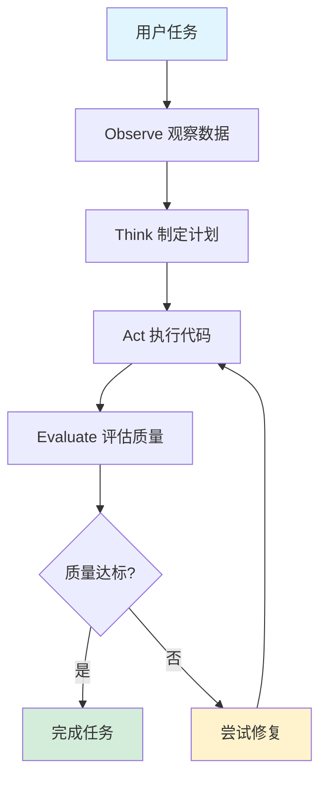

# ExcelMind AI 多步分析系统 - 实现指南

## 📋 目录

1. [系统概述](#系统概述)
2. [架构设计](#架构设计)
3. [核心模块](#核心模块)
4. [使用指南](#使用指南)
5. [API 参考](#api-参考)
6. [最佳实践](#最佳实践)
7. [故障排除](#故障排除)
8. [性能优化](#性能优化)

---

## 系统概述

### 设计理念

本系统基于 **Observe-Think-Act-Evaluate (OTAE)** 循环模式，实现了一个能够自我观察、思考、执行和评估的智能编排器。系统核心特点：

- ✅ **智能编排**: 自动将复杂任务分解为可执行的步骤
- ✅ **自我修复**: 检测错误并自动应用修复策略
- ✅ **质量保证**: 多维度质量评估，确保输出质量
- ✅ **灵活配置**: 支持多种预设模式和自定义配置
- ✅ **可观测性**: 详细的日志和进度监控

### 技术栈

- **TypeScript**: 类型安全的实现
- **智谱 AI**: 强大的代码生成能力
- **Python 执行环境**: 安全的代码沙箱
- **Excel 服务**: 多sheet数据处理

---

## 架构设计

### OTAE 循环



### 模块结构

```
types/
└── agenticTypes.ts          # 完整的类型定义系统

services/agentic/
├── index.ts                 # 统一导出接口
├── config.ts                # 配置管理
├── utils.ts                 # 工具函数集合
├── AgenticOrchestrator.ts   # 核心编排器
├── example.ts               # 使用示例
├── AgenticOrchestrator.test.ts  # 单元测试
└── README.md                # 详细文档
```

---

## 核心模块

### 1. 类型定义系统

**位置**: `types/agenticTypes.ts`

定义了系统的完整类型体系：

```typescript
// 核心类型
- MultiStepTask           // 多步任务状态
- TaskStatus             // 任务状态枚举
- TaskContext            // 任务上下文
- ExecutionPlan          // 执行计划

// 错误处理
- TaskError              // 任务错误
- ErrorCategory          // 错误分类
- ErrorAnalysis          // 错误分析
- RepairStrategy         // 修复策略

// 质量保证
- QualityReport          // 质量报告
- StepFeedback           // 步骤反馈

// 结果输出
- TaskResult             // 任务结果
- ObservationResult      // 观察结果
- ThinkingResult         // 思考结果
- StepResult             // 步骤结果
- EvaluationResult       // 评估结果
```

### 2. 核心编排器

**位置**: `services/agentic/AgenticOrchestrator.ts`

主要职责：

```typescript
class AgenticOrchestrator {
  // 主入口：执行完整任务
  async executeTask(userPrompt, dataFiles): Promise<TaskResult>

  // OTAE 循环
  private async observeStep(): Promise<ObservationResult>
  private async thinkStep(): Promise<ThinkingResult>
  private async actStep(plan): Promise<StepResult>
  private async evaluateStep(result): Promise<EvaluationResult>

  // 错误处理
  private async handleError(error): Promise<RepairResult>

  // 状态管理
  getTaskState(): MultiStepTask
  updateProgress(callback): void
}
```

**关键特性**：

- 🔍 **深度观察**: 分析数据结构、质量、模式、元数据
- 🧠 **智能思考**: 基于 AI 生成最优执行计划
- ⚡ **高效执行**: 自动生成并执行 Python 代码
- ✅ **严格评估**: 多维度质量检查和验证
- 🔧 **自动修复**: 智能错误分析和修复策略

### 3. 工具函数集

**位置**: `services/agentic/utils.ts`

提供的便捷函数：

```typescript
// 执行分析
executeMultiStepAnalysis(prompt, files, config?)
executeMultiStepAnalysisWithProgress(prompt, files, callback, config?)

// 验证和格式化
validateDataFiles(files)
formatExecutionTime(ms)
formatQualityScore(score)
isTaskSuccessful(result)

// 报告生成
getTaskSummary(result)
generateTaskReport(result)

// 辅助工具
createProgressLogger(prefix)
analyzeError(message)
estimateExecutionTime(fileCount, rowCount, complexity)
```

### 4. 配置系统

**位置**: `services/agentic/config.ts`

预设模式：

```typescript
// 默认配置
DEFAULT_ORCHESTRATOR_CONFIG

// 快速模式（简单任务）
FAST_MODE_CONFIG

// 高质量模式（复杂任务）
HIGH_QUALITY_MODE_CONFIG

// 调试模式（开发调试）
DEBUG_MODE_CONFIG
```

---

## 使用指南

### 基础使用

#### 1. 最简单的用法

```typescript
import { executeMultiStepAnalysis } from './services/agentic';

// 准备数据
const dataFiles = [
  {
    id: 'file-1',
    fileName: 'sales.xlsx',
    sheets: {
      'Sheet1': [
        { product: 'A', amount: 100 },
        { product: 'B', amount: 200 }
      ]
    },
    currentSheetName: 'Sheet1'
  }
];

// 执行分析
const result = await executeMultiStepAnalysis(
  '计算总销售额',
  dataFiles
);

// 检查结果
if (result.success) {
  console.log('成功！', result.data);
} else {
  console.log('失败', result.executionSummary.failedSteps);
}
```

#### 2. 带进度监控

```typescript
import {
  executeMultiStepAnalysisWithProgress,
  createProgressLogger
} from './services/agentic';

// 创建进度日志器
const logger = createProgressLogger('[分析] ');

// 执行并监控
const result = await executeMultiStepAnalysisWithProgress(
  '分析销售数据',
  dataFiles,
  logger,  // 进度回调
  {
    maxRetries: 3,
    qualityThreshold: 0.8
  }
);
```

#### 3. 高级控制

```typescript
import { AgenticOrchestrator } from './services/agentic';

// 创建编排器
const orchestrator = new AgenticOrchestrator({
  maxRetries: 5,
  timeoutPerStep: 60000,
  qualityThreshold: 0.9,
  enableAutoRepair: true,
  logLevel: 'debug'
});

// 注册进度回调
orchestrator.updateProgress((state) => {
  console.log(`${state.progress.percentage}% - ${state.progress.message}`);

  // 根据状态执行特定操作
  if (state.status === TaskStatus.REPAIRING) {
    console.log('正在修复错误...');
  }
});

// 执行任务
const result = await orchestrator.executeTask(
  '复杂的分析任务',
  dataFiles
);

// 获取日志
const logs = orchestrator.getLogs();

// 获取统计
const stats = orchestrator.getStatistics();
```

### 数据准备

#### 单 Sheet 数据

```typescript
const singleSheetData: DataFileInfo = {
  id: 'file-1',
  fileName: 'data.xlsx',
  sheets: {
    'Sheet1': [
      { column1: 'value1', column2: 'value2' },
      { column1: 'value3', column2: 'value4' }
    ]
  },
  currentSheetName: 'Sheet1'
};
```

#### 多 Sheet 数据

```typescript
const multiSheetData: DataFileInfo = {
  id: 'file-1',
  fileName: 'report.xlsx',
  sheets: {
    '收入': [
      { month: '1月', amount: 100000 },
      { month: '2月', amount: 120000 }
    ],
    '支出': [
      { month: '1月', amount: 80000 },
      { month: '2月', amount: 90000 }
    ]
  },
  currentSheetName: '收入',
  metadata: {
    '收入': {
      comments: { 'A1': '重要注释' },
      notes: {},
      rowCount: 2,
      columnCount: 2
    }
  }
};
```

### 常见使用场景

#### 1. 数据转换

```typescript
const result = await executeMultiStepAnalysis(
  '将所有日期格式转换为 YYYY-MM-DD，并将金额保留两位小数',
  dataFiles
);
```

#### 2. 数据计算

```typescript
const result = await executeMultiStepAnalysis(
  '计算每个部门的平均薪资、最高薪资和最低薪资',
  dataFiles
);
```

#### 3. 数据分析

```typescript
const result = await executeMultiStepAnalysis(
  '分析销售数据，找出增长最快的产品类别，并预测下月趋势',
  dataFiles
);
```

#### 4. 数据验证

```typescript
const result = await executeMultiStepAnalysis(
  '检查所有交易记录，标记异常交易（金额>50000或未审批）',
  dataFiles
);
```

#### 5. 审计分析

```typescript
const result = await executeMultiStepAnalysis(
  `
  执行审计程序：
  1. 识别所有大于50000元的交易
  2. 按部门分组统计总金额
  3. 检查是否有未审批的交易
  4. 标记需要进一步调查的交易
  `,
  dataFiles
);
```

---

## API 参考

### executeMultiStepAnalysis

执行多步分析的便捷函数。

**签名**:
```typescript
async function executeMultiStepAnalysis(
  userPrompt: string,
  dataFiles: DataFileInfo[],
  config?: Partial<OrchestratorConfig>
): Promise<TaskResult>
```

**参数**:
- `userPrompt` (string): 用户的自然语言指令
- `dataFiles` (DataFileInfo[]): 数据文件列表
- `config` (Partial<OrchestratorConfig>, 可选): 配置选项

**返回**: `Promise<TaskResult>`

**示例**:
```typescript
const result = await executeMultiStepAnalysis(
  '计算总销售额',
  dataFiles,
  { maxRetries: 3, qualityThreshold: 0.8 }
);
```

### AgenticOrchestrator

核心编排器类。

**构造函数**:
```typescript
constructor(config?: Partial<OrchestratorConfig>)
```

**方法**:

#### executeTask
执行完整的多步分析任务。

```typescript
async executeTask(
  userPrompt: string,
  dataFiles: DataFileInfo[]
): Promise<TaskResult>
```

#### updateProgress
注册进度回调函数。

```typescript
updateProgress(callback: ProgressCallback): void
```

#### getTaskState
获取当前任务状态。

```typescript
getTaskState(): MultiStepTask | null
```

#### cancelTask
取消当前任务。

```typescript
cancelTask(): void
```

#### getLogs
获取执行日志。

```typescript
getLogs(): LogEntry[]
```

#### clearLogs
清除日志。

```typescript
clearLogs(): void
```

#### getStatistics
获取统计信息。

```typescript
getStatistics(): Statistics
```

### OrchestratorConfig

配置选项接口。

```typescript
interface OrchestratorConfig {
  maxRetries: number;              // 最大重试次数 (默认: 3)
  timeoutPerStep: number;          // 每步超时时间 (默认: 30000ms)
  totalTimeout: number;            // 总超时时间 (默认: 300000ms)
  qualityThreshold: number;        // 质量阈值 (默认: 0.8)
  enableAutoRepair: boolean;       // 启用自动修复 (默认: true)
  enableCaching: boolean;          // 启用缓存 (默认: true)
  logLevel: LogLevel;              // 日志级别 (默认: 'info')
  aiModel: string;                 // AI模型 (默认: 'glm-4.6')
  maxTokens: number;               // 最大token数 (默认: 4096)
}
```

---

## 最佳实践

### 1. 数据准备

✅ **推荐做法**:
- 提供清晰的列名
- 包含足够的样本数据
- 添加有用的元数据（注释、标注）
- 确保数据格式一致

❌ **避免**:
- 列名含糊不清（如 "Column1", "Data"）
- 数据量过大（考虑采样）
- 缺少必要的上下文信息

### 2. 指令编写

✅ **推荐做法**:
```typescript
// 清晰具体
'计算每个部门的平均薪资，按部门分组显示'

// 提供上下文
'分析销售数据，重点关注电子产品类别，找出销售额下降的原因'

// 明确期望
'将结果输出为两个文件：汇总表（按部门）和明细表（按产品）'
```

❌ **避免**:
```typescript
// 过于模糊
'处理一下数据'

// 缺少上下文
'计算平均值'

// 指令不明确
'分析这个'
```

### 3. 配置选择

根据任务复杂度选择合适的配置：

```typescript
// 简单任务 - 快速模式
const simpleConfig = FAST_MODE_CONFIG;

// 复杂任务 - 高质量模式
const complexConfig = HIGH_QUALITY_MODE_CONFIG;

// 开发调试 - 调试模式
const debugConfig = DEBUG_MODE_CONFIG;
```

### 4. 错误处理

```typescript
try {
  const result = await orchestrator.executeTask(prompt, dataFiles);

  if (!result.success) {
    // 分析失败原因
    const summary = getTaskSummary(result);
    console.log('失败原因:', summary.failed);

    // 查看日志
    const logs = orchestrator.getLogs();
    logs.forEach(log => {
      if (log.level === 'error') {
        console.error(log.message);
      }
    });
  }
} catch (error) {
  console.error('执行异常:', error);
}
```

### 5. 性能优化

```typescript
// 限制数据量
const sampledData = data.map(file => ({
  ...file,
  sheets: {
    [file.currentSheetName]: file.sheets[file.currentSheetName].slice(0, 100)
  }
}));

// 使用快速模式
const result = await executeMultiStepAnalysis(
  prompt,
  sampledData,
  FAST_MODE_CONFIG
);

// 启用缓存
const orchestrator = new AgenticOrchestrator({
  enableCaching: true
});
```

---

## 故障排除

### 问题1: 任务执行失败

**症状**: `result.success === false`

**可能原因**:
1. 数据格式不正确
2. 指令不够清晰
3. AI 服务调用失败
4. 代码执行错误

**解决方案**:
```typescript
// 1. 验证数据
const validation = validateDataFiles(dataFiles);
if (!validation.valid) {
  console.error('数据验证失败:', validation.errors);
}

// 2. 查看详细日志
const logs = orchestrator.getLogs();
logs.forEach(log => console.log(log));

// 3. 降低质量阈值
const result = await executeMultiStepAnalysis(
  prompt,
  dataFiles,
  { qualityThreshold: 0.6 }
);

// 4. 增加重试次数
const result = await executeMultiStepAnalysis(
  prompt,
  dataFiles,
  { maxRetries: 5 }
);
```

### 问题2: 执行超时

**症状**: 执行时间过长或超时

**解决方案**:
```typescript
// 增加超时时间
const result = await executeMultiStepAnalysis(
  prompt,
  dataFiles,
  {
    timeoutPerStep: 60000,  // 60秒
    totalTimeout: 300000    // 5分钟
  }
);

// 减少数据量
const sampledData = sampleData(dataFiles, 100);

// 使用快速模式
const result = await executeMultiStepAnalysis(
  prompt,
  sampledData,
  FAST_MODE_CONFIG
);
```

### 问题3: 质量评分低

**症状**: `qualityReport.overallQuality < threshold`

**解决方案**:
```typescript
// 1. 改进指令清晰度
const improvedPrompt = `
请分析销售数据：
1. 计算每个产品的总销售额
2. 按销售额降序排列
3. 输出到新文件 "result.xlsx"
`;

// 2. 提供更多上下文
const result = await executeMultiStepAnalysis(
  improvedPrompt,
  dataFiles,
  { qualityThreshold: 0.7 }  // 降低阈值
);

// 3. 使用高质量模式
const result = await executeMultiStepAnalysis(
  prompt,
  dataFiles,
  HIGH_QUALITY_MODE_CONFIG
);
```

### 问题4: AI 调用失败

**症状**: AI 服务错误或超时

**解决方案**:
```typescript
// 1. 检查 API 配置
console.log('API Key:', process.env.ZHIPU_API_KEY);

// 2. 增加重试次数
const orchestrator = new AgenticOrchestrator({
  maxRetries: 5,
  enableAutoRepair: true
});

// 3. 使用降级策略
const result = await executeMultiStepAnalysis(
  prompt,
  dataFiles,
  {
    enableCaching: true  // 使用缓存
  }
);
```

---

## 性能优化

### 优化建议

1. **数据采样**
```typescript
// 对大数据集进行采样
const sampleSize = 100;
const sampledData = data.map(file => ({
  ...file,
  sheets: Object.fromEntries(
    Object.entries(file.sheets).map(([name, data]) => [
      name,
      data.slice(0, sampleSize)
    ])
  )
}));
```

2. **并行处理**
```typescript
// 并行执行多个独立任务
const results = await Promise.all([
  executeMultiStepAnalysis(prompt1, data1),
  executeMultiStepAnalysis(prompt2, data2),
  executeMultiStepAnalysis(prompt3, data3)
]);
```

3. **缓存利用**
```typescript
// 启用缓存
const orchestrator = new AgenticOrchestrator({
  enableCaching: true
});
```

4. **合理配置**
```typescript
// 根据任务复杂度选择配置
const config = isComplexTask
  ? HIGH_QUALITY_MODE_CONFIG
  : FAST_MODE_CONFIG;
```

### 性能指标

- **简单任务**: 3-10秒
- **中等任务**: 10-30秒
- **复杂任务**: 30-60秒
- **超大数据**: > 60秒（建议采样）

---

## 总结

本多步分析系统提供了一个强大、灵活、可靠的数据分析解决方案。通过 OTAE 循环和自动修复机制，系统能够处理复杂的数据分析任务，并在出现错误时自动恢复。

### 关键优势

- ✅ **智能化**: AI 驱动的代码生成和优化
- ✅ **可靠性**: 自动错误检测和修复
- ✅ **可扩展**: 模块化设计，易于扩展
- ✅ **可观测**: 详细的日志和进度监控
- ✅ **易用性**: 简洁的 API，开箱即用

### 下一步

1. 查看 `example.ts` 了解更多使用示例
2. 运行 `AgenticOrchestrator.test.ts` 验证功能
3. 阅读 `README.md` 获取详细文档
4. 根据实际需求调整配置

---

**版本**: 1.0.0
**更新日期**: 2025-01-21
**维护者**: Backend Developer
